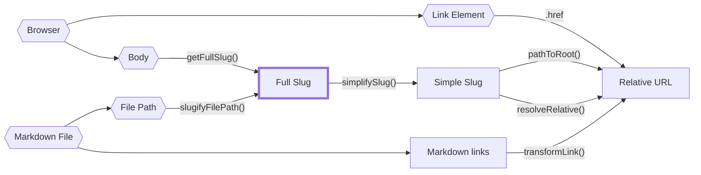
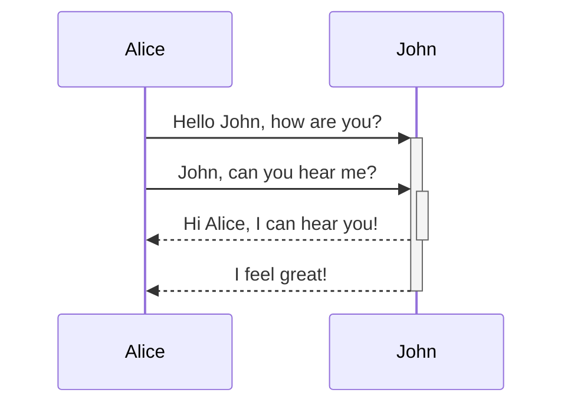

---

# File: ./advanced/architecture.md


---
title: Architecture
---

Quartz is a static site generator. How does it work?

This question is best answered by tracing what happens when a user (you!) runs `npx quartz build` in the command line:

## On the server

1. After running `npx quartz build`, npm will look at `package.json` to find the `bin` entry for `quartz` which points at `./quartz/bootstrap-cli.mjs`.
2. This file has a [shebang](<https://en.wikipedia.org/wiki/Shebang_(Unix)>) line at the top which tells npm to execute it using Node.
3. `bootstrap-cli.mjs` is responsible for a few things:
   1. Parsing the command-line arguments using [yargs](http://yargs.js.org/).
   2. Transpiling and bundling the rest of Quartz (which is in Typescript) to regular JavaScript using [esbuild](https://esbuild.github.io/). The `esbuild` configuration here is slightly special as it also handles `.scss` file imports using [esbuild-sass-plugin v2](https://www.npmjs.com/package/esbuild-sass-plugin). Additionally, we bundle 'inline' client-side scripts (any `.inline.ts` file) that components declare using a custom `esbuild` plugin that runs another instance of `esbuild` which bundles for the browser instead of `node`. Modules of both types are imported as plain text.
   3. Running the local preview server if `--serve` is set. This starts two servers:
      1. A WebSocket server on port 3001 to handle hot-reload signals. This tracks all inbound connections and sends a 'rebuild' message a server-side change is detected (either content or configuration).
      2. An HTTP file-server on a user defined port (normally 8080) to serve the actual website files.
   4. If the `--serve` flag is set, it also starts a file watcher to detect source-code changes (e.g. anything that is `.ts`, `.tsx`, `.scss`, or packager files). On a change, we rebuild the module (step 2 above) using esbuild's [rebuild API](https://esbuild.github.io/api/#rebuild) which drastically reduces the build times.
   5. After transpiling the main Quartz build module (`quartz/build.ts`), we write it to a cache file `.quartz-cache/transpiled-build.mjs` and then dynamically import this using `await import(cacheFile)`. However, we need to be pretty smart about how to bust Node's [import cache](https://github.com/nodejs/modules/issues/307) so we add a random query string to fake Node into thinking it's a new module. This does, however, cause memory leaks so we just hope that the user doesn't hot-reload their configuration too many times in a single session :)) (it leaks about ~350kB memory on each reload). After importing the module, we then invoke it, passing in the command line arguments we parsed earlier along with a callback function to signal the client to refresh.
4. In `build.ts`, we start by installing source map support manually to account for the query string cache busting hack we introduced earlier. Then, we start processing content:
   1. Clean the output directory.
   2. Recursively glob all files in the `content` folder, respecting the `.gitignore`.
   3. Parse the Markdown files.
      1. Quartz detects the number of threads available and chooses to spawn worker threads if there are >128 pieces of content to parse (rough heuristic). If it needs to spawn workers, it will invoke esbuild again to transpile the worker script `quartz/worker.ts`. Then, a work-stealing [workerpool](https://www.npmjs.com/package/workerpool) is then created and batches of 128 files are assigned to workers.
      2. Each worker (or just the main thread if there is no concurrency) creates a [unified](https://github.com/unifiedjs/unified) parser based off of the plugins defined in the [[configuration]].
      3. Parsing has three steps:
         1. Read the file into a [vfile](https://github.com/vfile/vfile).
         2. Applied plugin-defined text transformations over the content.
         3. Slugify the file path and store it in the data for the file. See the page on [[paths]] for more details about how path logic works in Quartz (spoiler: its complicated).
         4. Markdown parsing using [remark-parse](https://www.npmjs.com/package/remark-parse) (text to [mdast](https://github.com/syntax-tree/mdast)).
         5. Apply plugin-defined Markdown-to-Markdown transformations.
         6. Convert Markdown into HTML using [remark-rehype](https://github.com/remarkjs/remark-rehype) ([mdast](https://github.com/syntax-tree/mdast) to [hast](https://github.com/syntax-tree/hast)).
         7. Apply plugin-defined HTML-to-HTML transformations.
   4. Filter out unwanted content using plugins.
   5. Emit files using plugins.
      1. Gather all the static resources (e.g. external CSS, JS modules, etc.) each emitter plugin declares.
      2. Emitters that emit HTML files do a bit of extra work here as they need to transform the [hast](https://github.com/syntax-tree/hast) produced in the parse step to JSX. This is done using [hast-util-to-jsx-runtime](https://github.com/syntax-tree/hast-util-to-jsx-runtime) with the [Preact](https://preactjs.com/) runtime. Finally, the JSX is rendered to HTML using [preact-render-to-string](https://github.com/preactjs/preact-render-to-string) which statically renders the JSX to HTML (i.e. doesn't care about `useState`, `useEffect`, or any other React/Preact interactive bits). Here, we also do a bunch of fun stuff like assemble the page [[layout]] from `quartz.layout.ts`, assemble all the inline scripts that actually get shipped to the client, and all the transpiled styles. The bulk of this logic can be found in `quartz/components/renderPage.tsx`. Other fun things of note:
         1. CSS is minified and transformed using [Lightning CSS](https://github.com/parcel-bundler/lightningcss) to add vendor prefixes and do syntax lowering.
         2. Scripts are split into `beforeDOMLoaded` and `afterDOMLoaded` and are inserted in the `<head>` and `<body>` respectively.
      3. Finally, each emitter plugin is responsible for emitting and writing it's own emitted files to disk.
   6. If the `--serve` flag was detected, we also set up another file watcher to detect content changes (only `.md` files). We keep a content map that tracks the parsed AST and plugin data for each slug and update this on file changes. Newly added or modified paths are rebuilt and added to the content map. Then, all the filters and emitters are run over the resulting content map. This file watcher is debounced with a threshold of 250ms. On success, we send a client refresh signal using the passed in callback function.

## On the client

1. The browser opens a Quartz page and loads the HTML. The `<head>` also links to page styles (emitted to `public/index.css`) and page-critical JS (emitted to `public/prescript.js`)
2. Then, once the body is loaded, the browser loads the non-critical JS (emitted to `public/postscript.js`)
3. Once the page is done loading, the page will then dispatch a custom synthetic browser event `"nav"`. This is used so client-side scripts declared by components can 'setup' anything that requires access to the page DOM.
   1. If the [[SPA Routing|enableSPA option]] is enabled in the [[configuration]], this `"nav"` event is also fired on any client-navigation to allow for components to unregister and reregister any event handlers and state.
   2. If it's not, we wire up the `"nav"` event to just be fired a single time after page load to allow for consistency across how state is setup across both SPA and non-SPA contexts.

The architecture and design of the plugin system was intentionally left pretty vague here as this is described in much more depth in the guide on [[making plugins|making your own plugin]].


---

# File: ./advanced/creating components.md


---
title: Creating your own Quartz components
---

> [!warning]
> This guide assumes you have experience writing JavaScript and are familiar with TypeScript.

Normally on the web, we write layout code using HTML which looks something like the following:

```html
<article>
  <h1>An article header</h1>
  <p>Some content</p>
</article>
```

This piece of HTML represents an article with a leading header that says "An article header" and a paragraph that contains the text "Some content". This is combined with CSS to style the page and JavaScript to add interactivity.

However, HTML doesn't let you create reusable templates. If you wanted to create a new page, you would need to copy and paste the above snippet and edit the header and content yourself. This isn't great if we have a lot of content on our site that shares a lot of similar layout. The smart people who created React also had similar complaints and invented the concept of Components -- JavaScript functions that return JSX -- to solve the code duplication problem.

In effect, components allow you to write a JavaScript function that takes some data and produces HTML as an output. **While Quartz doesn't use React, it uses the same component concept to allow you to easily express layout templates in your Quartz site.**

## An Example Component

### Constructor

Component files are written in `.tsx` files that live in the `quartz/components` folder. These are re-exported in `quartz/components/index.ts` so you can use them in layouts and other components more easily.

Each component file should have a default export that satisfies the `QuartzComponentConstructor` function signature. It's a function that takes in a single optional parameter `opts` and returns a Quartz Component. The type of the parameters `opts` is defined by the interface `Options` which you as the component creator also decide.

In your component, you can use the values from the configuration option to change the rendering behaviour inside of your component. For example, the component in the code snippet below will not render if the `favouriteNumber` option is below 0.

```tsx {11-17}
interface Options {
  favouriteNumber: number
}

const defaultOptions: Options = {
  favouriteNumber: 42,
}

export default ((userOpts?: Options) => {
  const opts = { ...userOpts, ...defaultOpts }
  function YourComponent(props: QuartzComponentProps) {
    if (opts.favouriteNumber < 0) {
      return null
    }

    return <p>My favourite number is {opts.favouriteNumber}</p>
  }

  return YourComponent
}) satisfies QuartzComponentConstructor
```

### Props

The Quartz component itself (lines 11-17 highlighted above) looks like a React component. It takes in properties (sometimes called [props](https://react.dev/learn/passing-props-to-a-component)) and returns JSX.

All Quartz components accept the same set of props:

```tsx title="quartz/components/types.ts"
// simplified for sake of demonstration
export type QuartzComponentProps = {
  fileData: QuartzPluginData
  cfg: GlobalConfiguration
  tree: Node<QuartzPluginData>
  allFiles: QuartzPluginData[]
  displayClass?: "mobile-only" | "desktop-only"
}
```

- `fileData`: Any metadata [[making plugins|plugins]] may have added to the current page.
  - `fileData.slug`: slug of the current page.
  - `fileData.frontmatter`: any frontmatter parsed.
- `cfg`: The `configuration` field in `quartz.config.ts`.
- `tree`: the resulting [HTML AST](https://github.com/syntax-tree/hast) after processing and transforming the file. This is useful if you'd like to render the content using [hast-util-to-jsx-runtime](https://github.com/syntax-tree/hast-util-to-jsx-runtime) (you can find an example of this in `quartz/components/pages/Content.tsx`).
- `allFiles`: Metadata for all files that have been parsed. Useful for doing page listings or figuring out the overall site structure.
- `displayClass`: a utility class that indicates a preference from the user about how to render it in a mobile or desktop setting. Helpful if you want to conditionally hide a component on mobile or desktop.

### Styling

Quartz components can also define a `.css` property on the actual function component which will get picked up by Quartz. This is expected to be a CSS string which can either be inlined or imported from a `.scss` file.

Note that inlined styles **must** be plain vanilla CSS:

```tsx {6-10} title="quartz/components/YourComponent.tsx"
export default (() => {
  function YourComponent() {
    return <p class="red-text">Example Component</p>
  }

  YourComponent.css = `
  p.red-text {
    color: red;
  }
  `

  return YourComponent
}) satisfies QuartzComponentConstructor
```

Imported styles, however, can be from SCSS files:

```tsx {1-2,9} title="quartz/components/YourComponent.tsx"
// assuming your stylesheet is in quartz/components/styles/YourComponent.scss
import styles from "./styles/YourComponent.scss"

export default (() => {
  function YourComponent() {
    return <p>Example Component</p>
  }

  YourComponent.css = styles
  return YourComponent
}) satisfies QuartzComponentConstructor
```

> [!warning]
> Quartz does not use CSS modules so any styles you declare here apply _globally_. If you only want it to apply to your component, make sure you use specific class names and selectors.

### Scripts and Interactivity

What about interactivity? Suppose you want to add an-click handler for example. Like the `.css` property on the component, you can also declare `.beforeDOMLoaded` and `.afterDOMLoaded` properties that are strings that contain the script.

```tsx title="quartz/components/YourComponent.tsx"
export default (() => {
  function YourComponent() {
    return <button id="btn">Click me</button>
  }

  YourComponent.beforeDOMLoaded = `
  console.log("hello from before the page loads!")
  `

  YourComponent.afterDOMLoaded = `
  document.getElementById('btn').onclick = () => {
    alert('button clicked!')
  }
  `
  return YourComponent
}) satisfies QuartzComponentConstructor
```

> [!hint]
> For those coming from React, Quartz components are different from React components in that it only uses JSX for templating and layout. Hooks like `useEffect`, `useState`, etc. are not rendered and other properties that accept functions like `onClick` handlers will not work. Instead, do it using a regular JS script that modifies the DOM element directly.

As the names suggest, the `.beforeDOMLoaded` scripts are executed _before_ the page is done loading so it doesn't have access to any elements on the page. This is mostly used to prefetch any critical data.

The `.afterDOMLoaded` script executes once the page has been completely loaded. This is a good place to setup anything that should last for the duration of a site visit (e.g. getting something saved from local storage).

If you need to create an `afterDOMLoaded` script that depends on _page specific_ elements that may change when navigating to a new page, you can listen for the `"nav"` event that gets fired whenever a page loads (which may happen on navigation if [[SPA Routing]] is enabled).

```ts
document.addEventListener("nav", () => {
  // do page specific logic here
  // e.g. attach event listeners
  const toggleSwitch = document.querySelector("#switch") as HTMLInputElement
  toggleSwitch.addEventListener("change", switchTheme)
  window.addCleanup(() => toggleSwitch.removeEventListener("change", switchTheme))
})
```

You can also add the equivalent of a `beforeunload` event for [[SPA Routing]] via the `prenav` event.

```ts
document.addEventListener("prenav", () => {
  // executed after an SPA navigation is triggered but
  // before the page is replaced
  // one usage pattern is to store things in sessionStorage
  // in the prenav and then conditionally load then in the consequent
  // nav
})
```

It is best practice to track any event handlers via `window.addCleanup` to prevent memory leaks.
This will get called on page navigation.

#### Importing Code

Of course, it isn't always practical (nor desired!) to write your code as a string literal in the component.

Quartz supports importing component code through `.inline.ts` files.

```tsx title="quartz/components/YourComponent.tsx"
// @ts-ignore: typescript doesn't know about our inline bundling system
// so we need to silence the error
import script from "./scripts/graph.inline"

export default (() => {
  function YourComponent() {
    return <button id="btn">Click me</button>
  }

  YourComponent.afterDOMLoaded = script
  return YourComponent
}) satisfies QuartzComponentConstructor
```

```ts title="quartz/components/scripts/graph.inline.ts"
// any imports here are bundled for the browser
import * as d3 from "d3"

document.getElementById("btn").onclick = () => {
  alert("button clicked!")
}
```

Additionally, like what is shown in the example above, you can import packages in `.inline.ts` files. This will be bundled by Quartz and included in the actual script.

### Using a Component

After creating your custom component, re-export it in `quartz/components/index.ts`:

```ts title="quartz/components/index.ts" {4,10}
import ArticleTitle from "./ArticleTitle"
import Content from "./pages/Content"
import Darkmode from "./Darkmode"
import YourComponent from "./YourComponent"

export { ArticleTitle, Content, Darkmode, YourComponent }
```

Then, you can use it like any other component in `quartz.layout.ts` via `Component.YourComponent()`. See the [[configuration#Layout|layout]] section for more details.

As Quartz components are just functions that return React components, you can compositionally use them in other Quartz components.

```tsx title="quartz/components/AnotherComponent.tsx"
import YourComponentConstructor from "./YourComponent"

export default (() => {
  const YourComponent = YourComponentConstructor()

  function AnotherComponent(props: QuartzComponentProps) {
    return (
      <div>
        <p>It's nested!</p>
        <YourComponent {...props} />
      </div>
    )
  }

  return AnotherComponent
}) satisfies QuartzComponentConstructor
```

> [!hint]
> Look in `quartz/components` for more examples of components in Quartz as reference for your own components!


---

# File: ./advanced/index.md


---
title: "Advanced"
---


---

# File: ./advanced/making plugins.md


---
title: Making your own plugins
---

> [!warning]
> This part of the documentation will assume you have working knowledge in TypeScript and will include code snippets that describe the interface of what Quartz plugins should look like.

Quartz's plugins are a series of transformations over content. This is illustrated in the diagram of the processing pipeline below:

![[quartz transform pipeline.png]]

All plugins are defined as a function that takes in a single parameter for options `type OptionType = object | undefined` and return an object that corresponds to the type of plugin it is.

```ts
type OptionType = object | undefined
type QuartzPlugin<Options extends OptionType = undefined> = (opts?: Options) => QuartzPluginInstance
type QuartzPluginInstance =
  | QuartzTransformerPluginInstance
  | QuartzFilterPluginInstance
  | QuartzEmitterPluginInstance
```

The following sections will go into detail for what methods can be implemented for each plugin type. Before we do that, let's clarify a few more ambiguous types:

- `BuildCtx` is defined in `quartz/ctx.ts`. It consists of
  - `argv`: The command line arguments passed to the Quartz [[build]] command
  - `cfg`: The full Quartz [[configuration]]
  - `allSlugs`: a list of all the valid content slugs (see [[paths]] for more information on what a slug is)
- `StaticResources` is defined in `quartz/resources.tsx`. It consists of
  - `css`: a list of CSS style definitions that should be loaded. A CSS style is described with the `CSSResource` type which is also defined in `quartz/resources.tsx`. It accepts either a source URL or the inline content of the stylesheet.
  - `js`: a list of scripts that should be loaded. A script is described with the `JSResource` type which is also defined in `quartz/resources.tsx`. It allows you to define a load time (either before or after the DOM has been loaded), whether it should be a module, and either the source URL or the inline content of the script.
  - `additionalHead`: a list of JSX elements or functions that return JSX elements to be added to the `<head>` tag of the page. Functions receive the page's data as an argument and can conditionally render elements.

## Transformers

Transformers **map** over content, taking a Markdown file and outputting modified content or adding metadata to the file itself.

```ts
export type QuartzTransformerPluginInstance = {
  name: string
  textTransform?: (ctx: BuildCtx, src: string) => string
  markdownPlugins?: (ctx: BuildCtx) => PluggableList
  htmlPlugins?: (ctx: BuildCtx) => PluggableList
  externalResources?: (ctx: BuildCtx) => Partial<StaticResources>
}
```

All transformer plugins must define at least a `name` field to register the plugin and a few optional functions that allow you to hook into various parts of transforming a single Markdown file.

- `textTransform` performs a text-to-text transformation _before_ a file is parsed into the [Markdown AST](https://github.com/syntax-tree/mdast).
- `markdownPlugins` defines a list of [remark plugins](https://github.com/remarkjs/remark/blob/main/doc/plugins.md). `remark` is a tool that transforms Markdown to Markdown in a structured way.
- `htmlPlugins` defines a list of [rehype plugins](https://github.com/rehypejs/rehype/blob/main/doc/plugins.md). Similar to how `remark` works, `rehype` is a tool that transforms HTML to HTML in a structured way.
- `externalResources` defines any external resources the plugin may need to load on the client-side for it to work properly.

Normally for both `remark` and `rehype`, you can find existing plugins that you can use to . If you'd like to create your own `remark` or `rehype` plugin, checkout the [guide to creating a plugin](https://unifiedjs.com/learn/guide/create-a-plugin/) using `unified` (the underlying AST parser and transformer library).

A good example of a transformer plugin that borrows from the `remark` and `rehype` ecosystems is the [[plugins/Latex|Latex]] plugin:

```ts title="quartz/plugins/transformers/latex.ts"
import remarkMath from "remark-math"
import rehypeKatex from "rehype-katex"
import rehypeMathjax from "rehype-mathjax/svg"
import { QuartzTransformerPlugin } from "../types"

interface Options {
  renderEngine: "katex" | "mathjax"
}

export const Latex: QuartzTransformerPlugin<Options> = (opts?: Options) => {
  const engine = opts?.renderEngine ?? "katex"
  return {
    name: "Latex",
    markdownPlugins() {
      return [remarkMath]
    },
    htmlPlugins() {
      if (engine === "katex") {
        // if you need to pass options into a plugin, you
        // can use a tuple of [plugin, options]
        return [[rehypeKatex, { output: "html" }]]
      } else {
        return [rehypeMathjax]
      }
    },
    externalResources() {
      if (engine === "katex") {
        return {
          css: [
            {
              // base css
              content: "https://cdnjs.cloudflare.com/ajax/libs/KaTeX/0.16.9/katex.min.css",
            },
          ],
          js: [
            {
              // fix copy behaviour: https://github.com/KaTeX/KaTeX/blob/main/contrib/copy-tex/README.md
              src: "https://cdnjs.cloudflare.com/ajax/libs/KaTeX/0.16.9/contrib/copy-tex.min.js",
              loadTime: "afterDOMReady",
              contentType: "external",
            },
          ],
        }
      }
    },
  }
}
```

Another common thing that transformer plugins will do is parse a file and add extra data for that file:

```ts
export const AddWordCount: QuartzTransformerPlugin = () => {
  return {
    name: "AddWordCount",
    markdownPlugins() {
      return [
        () => {
          return (tree, file) => {
            // tree is an `mdast` root element
            // file is a `vfile`
            const text = file.value
            const words = text.split(" ").length
            file.data.wordcount = words
          }
        },
      ]
    },
  }
}

// tell typescript about our custom data fields we are adding
// other plugins will then also be aware of this data field
declare module "vfile" {
  interface DataMap {
    wordcount: number
  }
}
```

Finally, you can also perform transformations over Markdown or HTML ASTs using the `visit` function from the `unist-util-visit` package or the `findAndReplace` function from the `mdast-util-find-and-replace` package.

```ts
export const TextTransforms: QuartzTransformerPlugin = () => {
  return {
    name: "TextTransforms",
    markdownPlugins() {
      return [() => {
        return (tree, file) => {
          // replace _text_ with the italics version
          findAndReplace(tree, /_(.+)_/, (_value: string, ...capture: string[]) => {
            // inner is the text inside of the () of the regex
            const [inner] = capture
            // return an mdast node
            // https://github.com/syntax-tree/mdast
            return {
              type: "emphasis",
              children: [{ type: 'text', value: inner }]
            }
          })

         // remove all links (replace with just the link content)
         // match by 'type' field on an mdast node
         // https://github.com/syntax-tree/mdast#link in this example
          visit(tree, "link", (link: Link) => {
            return {
              type: "paragraph"
              children: [{ type: 'text', value: link.title }]
            }
          })
        }
      }]
    }
  }
}
```

All transformer plugins can be found under `quartz/plugins/transformers`. If you decide to write your own transformer plugin, don't forget to re-export it under `quartz/plugins/transformers/index.ts`

A parting word: transformer plugins are quite complex so don't worry if you don't get them right away. Take a look at the built in transformers and see how they operate over content to get a better sense for how to accomplish what you are trying to do.

## Filters

Filters **filter** content, taking the output of all the transformers and determining what files to actually keep and what to discard.

```ts
export type QuartzFilterPlugin<Options extends OptionType = undefined> = (
  opts?: Options,
) => QuartzFilterPluginInstance

export type QuartzFilterPluginInstance = {
  name: string
  shouldPublish(ctx: BuildCtx, content: ProcessedContent): boolean
}
```

A filter plugin must define a `name` field and a `shouldPublish` function that takes in a piece of content that has been processed by all the transformers and returns a `true` or `false` depending on whether it should be passed to the emitter plugins or not.

For example, here is the built-in plugin for removing drafts:

```ts title="quartz/plugins/filters/draft.ts"
import { QuartzFilterPlugin } from "../types"

export const RemoveDrafts: QuartzFilterPlugin<{}> = () => ({
  name: "RemoveDrafts",
  shouldPublish(_ctx, [_tree, vfile]) {
    // uses frontmatter parsed from transformers
    const draftFlag: boolean = vfile.data?.frontmatter?.draft ?? false
    return !draftFlag
  },
})
```

## Emitters

Emitters **reduce** over content, taking in a list of all the transformed and filtered content and creating output files.

```ts
export type QuartzEmitterPlugin<Options extends OptionType = undefined> = (
  opts?: Options,
) => QuartzEmitterPluginInstance

export type QuartzEmitterPluginInstance = {
  name: string
  emit(
    ctx: BuildCtx,
    content: ProcessedContent[],
    resources: StaticResources,
  ): Promise<FilePath[]> | AsyncGenerator<FilePath>
  partialEmit?(
    ctx: BuildCtx,
    content: ProcessedContent[],
    resources: StaticResources,
    changeEvents: ChangeEvent[],
  ): Promise<FilePath[]> | AsyncGenerator<FilePath> | null
  getQuartzComponents(ctx: BuildCtx): QuartzComponent[]
}
```

An emitter plugin must define a `name` field, an `emit` function, and a `getQuartzComponents` function. It can optionally implement a `partialEmit` function for incremental builds.

- `emit` is responsible for looking at all the parsed and filtered content and then appropriately creating files and returning a list of paths to files the plugin created.
- `partialEmit` is an optional function that enables incremental builds. It receives information about which files have changed (`changeEvents`) and can selectively rebuild only the necessary files. This is useful for optimizing build times in development mode. If `partialEmit` is undefined, it will default to the `emit` function.
- `getQuartzComponents` declares which Quartz components the emitter uses to construct its pages.

Creating new files can be done via regular Node [fs module](https://nodejs.org/api/fs.html) (i.e. `fs.cp` or `fs.writeFile`) or via the `write` function in `quartz/plugins/emitters/helpers.ts` if you are creating files that contain text. `write` has the following signature:

```ts
export type WriteOptions = (data: {
  // the build context
  ctx: BuildCtx
  // the name of the file to emit (not including the file extension)
  slug: FullSlug
  // the file extension
  ext: `.${string}` | ""
  // the file content to add
  content: string
}) => Promise<FilePath>
```

This is a thin wrapper around writing to the appropriate output folder and ensuring that intermediate directories exist. If you choose to use the native Node `fs` APIs, ensure you emit to the `argv.output` folder as well.

If you are creating an emitter plugin that needs to render components, there are three more things to be aware of:

- Your component should use `getQuartzComponents` to declare a list of `QuartzComponents` that it uses to construct the page. See the page on [[creating components]] for more information.
- You can use the `renderPage` function defined in `quartz/components/renderPage.tsx` to render Quartz components into HTML.
- If you need to render an HTML AST to JSX, you can use the `htmlToJsx` function from `quartz/util/jsx.ts`. An example of this can be found in `quartz/components/pages/Content.tsx`.

For example, the following is a simplified version of the content page plugin that renders every single page.

```tsx title="quartz/plugins/emitters/contentPage.tsx"
export const ContentPage: QuartzEmitterPlugin = () => {
  // construct the layout
  const layout: FullPageLayout = {
    ...sharedPageComponents,
    ...defaultContentPageLayout,
    pageBody: Content(),
  }
  const { head, header, beforeBody, pageBody, afterBody, left, right, footer } = layout
  return {
    name: "ContentPage",
    getQuartzComponents() {
      return [head, ...header, ...beforeBody, pageBody, ...afterBody, ...left, ...right, footer]
    },
    async emit(ctx, content, resources, emit): Promise<FilePath[]> {
      const cfg = ctx.cfg.configuration
      const fps: FilePath[] = []
      const allFiles = content.map((c) => c[1].data)
      for (const [tree, file] of content) {
        const slug = canonicalizeServer(file.data.slug!)
        const externalResources = pageResources(slug, file.data, resources)
        const componentData: QuartzComponentProps = {
          fileData: file.data,
          externalResources,
          cfg,
          children: [],
          tree,
          allFiles,
        }

        const content = renderPage(cfg, slug, componentData, opts, externalResources)
        const fp = await emit({
          content,
          slug: file.data.slug!,
          ext: ".html",
        })

        fps.push(fp)
      }
      return fps
    },
  }
}
```

Note that it takes in a `FullPageLayout` as the options. It's made by combining a `SharedLayout` and a `PageLayout` both of which are provided through the `quartz.layout.ts` file.

> [!hint]
> Look in `quartz/plugins` for more examples of plugins in Quartz as reference for your own plugins!


---

# File: ./advanced/paths.md


---
title: Paths in Quartz
---

Paths are pretty complex to reason about because, especially for a static site generator, they can come from so many places.

A full file path to a piece of content? Also a path. What about a slug for a piece of content? Yet another path.

It would be silly to type these all as `string` and call it a day as it's pretty common to accidentally mistake one type of path for another. Unfortunately, TypeScript does not have [nominal types](https://en.wikipedia.org/wiki/Nominal_type_system) for type aliases meaning even if you made custom types of a server-side slug or a client-slug slug, you can still accidentally assign one to another and TypeScript wouldn't catch it.

Luckily, we can mimic nominal typing using [brands](https://www.typescriptlang.org/play#example/nominal-typing).

```typescript
// instead of
type FullSlug = string

// we do
type FullSlug = string & { __brand: "full" }

// that way, the following will fail typechecking
const slug: FullSlug = "some random string"
```

While this prevents most typing mistakes _within_ our nominal typing system (e.g. mistaking a server slug for a client slug), it doesn't prevent us from _accidentally_ mistaking a string for a client slug when we forcibly cast it.

Thus, we still need to be careful when casting from a string to one of these nominal types in the 'entrypoints', illustrated with hexagon shapes in the diagram below.

The following diagram draws the relationships between all the path sources, nominal path types, and what functions in `quartz/path.ts` convert between them.



Here are the main types of slugs with a rough description of each type of path:

- `FilePath`: a real file path to a file on disk. Cannot be relative and must have a file extension.
- `FullSlug`: cannot be relative and may not have leading or trailing slashes. It can have `index` as it's last segment. Use this wherever possible is it's the most 'general' interpretation of a slug.
- `SimpleSlug`: cannot be relative and shouldn't have `/index` as an ending or a file extension. It _can_ however have a trailing slash to indicate a folder path.
- `RelativeURL`: must start with `.` or `..` to indicate it's a relative URL. Shouldn't have `/index` as an ending or a file extension but can contain a trailing slash.

To get a clearer picture of how these relate to each other, take a look at the path tests in `quartz/util/path.test.ts`.


---

# File: ./authoring content.md


---
title: Authoring Content
---

All of the content in your Quartz should go in the `/content` folder. The content for the home page of your Quartz lives in `content/index.md`. If you've [[index#🪴 Get Started|setup Quartz]] already, this folder should already be initialized. Any Markdown in this folder will get processed by Quartz.

It is recommended that you use [Obsidian](https://obsidian.md/) as a way to edit and maintain your Quartz. It comes with a nice editor and graphical interface to preview, edit, and link your local files and attachments.

Got everything setup? Let's [[build]] and preview your Quartz locally!

## Syntax

As Quartz uses Markdown files as the main way of writing content, it fully supports Markdown syntax. By default, Quartz also ships with a few syntax extensions like [Github Flavored Markdown](https://docs.github.com/en/get-started/writing-on-github/getting-started-with-writing-and-formatting-on-github/basic-writing-and-formatting-syntax) (footnotes, strikethrough, tables, tasklists) and [Obsidian Flavored Markdown](https://help.obsidian.md/Editing+and+formatting/Obsidian+Flavored+Markdown) ([[callouts]], [[wikilinks]]).

Additionally, Quartz also allows you to specify additional metadata in your notes called **frontmatter**.

```md title="content/note.md"
---
title: Example Title
draft: false
tags:
  - example-tag
---

The rest of your content lives here. You can use **Markdown** here :)
```

Some common frontmatter fields that are natively supported by Quartz:

- `title`: Title of the page. If it isn't provided, Quartz will use the name of the file as the title.
- `description`: Description of the page used for link previews.
- `permalink`: A custom URL for the page that will remain constant even if the path to the file changes.
- `aliases`: Other names for this note. This is a list of strings.
- `tags`: Tags for this note.
- `draft`: Whether to publish the page or not. This is one way to make [[private pages|pages private]] in Quartz.
- `date`: A string representing the day the note was published. Normally uses `YYYY-MM-DD` format.

See [[Frontmatter]] for a complete list of frontmatter.

## Syncing your Content

When your Quartz is at a point you're happy with, you can save your changes to GitHub.
First, make sure you've [[setting up your GitHub repository|already setup your GitHub repository]] and then do `npx quartz sync`.

## Customization

Frontmatter parsing for `title`, `tags`, `aliases` and `cssclasses` is a functionality of the [[Frontmatter]] plugin, `date` is handled by the [[CreatedModifiedDate]] plugin and `description` by the [[Description]] plugin. See the plugin pages for customization options.


---

# File: ./build.md


---
title: "Building your Quartz"
---

Once you've [[index#🪴 Get Started|initialized]] Quartz, let's see what it looks like locally:

```bash
npx quartz build --serve
```

This will start a local web server to run your Quartz on your computer. Open a web browser and visit `http://localhost:8080/` to view it.

> [!hint] Flags and options
> For full help options, you can run `npx quartz build --help`.
>
> Most of these have sensible defaults but you can override them if you have a custom setup:
>
> - `-d` or `--directory`: the content folder. This is normally just `content`
> - `-v` or `--verbose`: print out extra logging information
> - `-o` or `--output`: the output folder. This is normally just `public`
> - `--serve`: run a local hot-reloading server to preview your Quartz
> - `--port`: what port to run the local preview server on
> - `--concurrency`: how many threads to use to parse notes

> [!warning] Not to be used for production
> Serve mode is intended for local previews only.
> For production workloads, see the page on [[hosting]].


---

# File: ./configuration.md


---
title: Configuration
---

Quartz is meant to be extremely configurable, even if you don't know any coding. Most of the configuration you should need can be done by just editing `quartz.config.ts` or changing [[layout|the layout]] in `quartz.layout.ts`.

> [!tip]
> If you edit Quartz configuration using a text-editor that has TypeScript language support like VSCode, it will warn you when you you've made an error in your configuration, helping you avoid configuration mistakes!

The configuration of Quartz can be broken down into two main parts:

```ts title="quartz.config.ts"
const config: QuartzConfig = {
  configuration: { ... },
  plugins: { ... },
}
```

## General Configuration

This part of the configuration concerns anything that can affect the whole site. The following is a list breaking down all the things you can configure:

- `pageTitle`: title of the site. This is also used when generating the [[RSS Feed]] for your site.
- `pageTitleSuffix`: a string added to the end of the page title. This only applies to the browser tab title, not the title shown at the top of the page.
- `enableSPA`: whether to enable [[SPA Routing]] on your site.
- `enablePopovers`: whether to enable [[popover previews]] on your site.
- `analytics`: what to use for analytics on your site. Values can be
  - `null`: don't use analytics;
  - `{ provider: 'google', tagId: '<your-google-tag>' }`: use Google Analytics;
  - `{ provider: 'plausible' }` (managed) or `{ provider: 'plausible', host: 'https://<your-plausible-host>' }` (self-hosted, make sure to include the `https://` protocol prefix): use [Plausible](https://plausible.io/);
  - `{ provider: 'umami', host: '<your-umami-host>', websiteId: '<your-umami-website-id>' }`: use [Umami](https://umami.is/);
  - `{ provider: 'goatcounter', websiteId: 'my-goatcounter-id' }` (managed) or `{ provider: 'goatcounter', websiteId: 'my-goatcounter-id', host: 'my-goatcounter-domain.com', scriptSrc: 'https://my-url.to/counter.js' }` (self-hosted) use [GoatCounter](https://goatcounter.com);
  - `{ provider: 'posthog', apiKey: '<your-posthog-project-apiKey>', host: '<your-posthog-host>' }`: use [Posthog](https://posthog.com/);
  - `{ provider: 'tinylytics', siteId: '<your-site-id>' }`: use [Tinylytics](https://tinylytics.app/);
  - `{ provider: 'cabin' }` or `{ provider: 'cabin', host: 'https://cabin.example.com' }` (custom domain): use [Cabin](https://withcabin.com);
  - `{provider: 'clarity', projectId: '<your-clarity-id-code' }`: use [Microsoft clarity](https://clarity.microsoft.com/). The project id can be found on top of the overview page.
  - `{ provider: 'matomo', siteId: '<your-matomo-id-code', host: 'matomo.example.com' }`: use [Matomo](https://matomo.org/), without protocol.
  - `{ provider: 'vercel' }`: use [Vercel Web Analytics](https://vercel.com/docs/concepts/analytics).
  - `{ provider: 'rybbit', siteId: 'my-rybbit-id' }` (managed) or `{ provider: 'rybbit', siteId: 'my-rybbit-id', host: 'my-rybbit-domain.com' }` (self-hosted) use [Rybbit](https://rybbit.com);
- `locale`: used for [[i18n]] and date formatting
- `baseUrl`: this is used for sitemaps and RSS feeds that require an absolute URL to know where the canonical 'home' of your site lives. This is normally the deployed URL of your site (e.g. `quartz.jzhao.xyz` for this site). Do not include the protocol (i.e. `https://`) or any leading or trailing slashes.
  - This should also include the subpath if you are [[hosting]] on GitHub pages without a custom domain. For example, if my repository is `jackyzha0/quartz`, GitHub pages would deploy to `https://jackyzha0.github.io/quartz` and the `baseUrl` would be `jackyzha0.github.io/quartz`.
  - Note that Quartz 4 will avoid using this as much as possible and use relative URLs whenever it can to make sure your site works no matter _where_ you end up actually deploying it.
- `ignorePatterns`: a list of [glob](<https://en.wikipedia.org/wiki/Glob_(programming)>) patterns that Quartz should ignore and not search through when looking for files inside the `content` folder. See [[private pages]] for more details.
- `defaultDateType`: whether to use created, modified, or published as the default date to display on pages and page listings.
- `theme`: configure how the site looks.
  - `cdnCaching`: if `true` (default), use Google CDN to cache the fonts. This will generally be faster. Disable (`false`) this if you want Quartz to download the fonts to be self-contained.
  - `typography`: what fonts to use. Any font available on [Google Fonts](https://fonts.google.com/) works here.
    - `title`: font for the title of the site (optional, same as `header` by default)
    - `header`: font to use for headers
    - `code`: font for inline and block quotes
    - `body`: font for everything
  - `colors`: controls the theming of the site.
    - `light`: page background
    - `lightgray`: borders
    - `gray`: graph links, heavier borders
    - `darkgray`: body text
    - `dark`: header text and icons
    - `secondary`: link colour, current [[graph view|graph]] node
    - `tertiary`: hover states and visited [[graph view|graph]] nodes
    - `highlight`: internal link background, highlighted text, [[syntax highlighting|highlighted lines of code]]
    - `textHighlight`: markdown highlighted text background

## Plugins

You can think of Quartz plugins as a series of transformations over content.

![[quartz transform pipeline.png]]

```ts title="quartz.config.ts"
plugins: {
  transformers: [...],
  filters: [...],
  emitters: [...],
}
```

- [[tags/plugin/transformer|Transformers]] **map** over content (e.g. parsing frontmatter, generating a description)
- [[tags/plugin/filter|Filters]] **filter** content (e.g. filtering out drafts)
- [[tags/plugin/emitter|Emitters]] **reduce** over content (e.g. creating an RSS feed or pages that list all files with a specific tag)

You can customize the behaviour of Quartz by adding, removing and reordering plugins in the `transformers`, `filters` and `emitters` fields.

> [!note]
> Each node is modified by every transformer _in order_. Some transformers are position sensitive, so you may need to pay particular attention to whether they need to come before or after certain other plugins.

You should take care to add the plugin to the right entry corresponding to its plugin type. For example, to add the [[ExplicitPublish]] plugin (a [[tags/plugin/filter|Filter]]), you would add the following line:

```ts title="quartz.config.ts"
filters: [
  ...
  Plugin.ExplicitPublish(),
  ...
],
```

To remove a plugin, you should remove all occurrences of it in the `quartz.config.ts`.

To customize plugins further, some plugins may also have their own configuration settings that you can pass in. If you do not pass in a configuration, the plugin will use its default settings.

For example, the [[plugins/Latex|Latex]] plugin allows you to pass in a field specifying the `renderEngine` to choose between Katex and MathJax.

```ts title="quartz.config.ts"
transformers: [
  Plugin.FrontMatter(), // use default options
  Plugin.Latex({ renderEngine: "katex" }), // set some custom options
]
```

Some plugins are included by default in the [`quartz.config.ts`](https://github.com/jackyzha0/quartz/blob/v4/quartz.config.ts), but there are more available.

You can see a list of all plugins and their configuration options [[tags/plugin|here]].

If you'd like to make your own plugins, see the [[making plugins|making custom plugins]] guide.

## Fonts

Fonts can be specified as a `string` or a `FontSpecification`:

```ts
// string
typography: {
  header: "Schibsted Grotesk",
  ...
}

// FontSpecification
typography: {
  header: {
    name: "Schibsted Grotesk",
    weights: [400, 700],
    includeItalic: true,
  },
  ...
}
```


---

# File: ./features/Citations.md


---
title: Citations
tags:
  - feature/transformer
---

Quartz uses [rehype-citation](https://github.com/timlrx/rehype-citation) to support parsing of a BibTex bibliography file.

Under the default configuration, a citation key `[@templeton2024scaling]` will be exported as `(Templeton et al., 2024)`.

> [!example]- BibTex file
>
> ```bib title="bibliography.bib"
> @article{templeton2024scaling,
>   title={Scaling Monosemanticity: Extracting Interpretable Features from Claude 3 Sonnet},
>   author={Templeton, Adly and Conerly, Tom and Marcus, Jonathan and Lindsey, Jack and Bricken, Trenton and Chen, Brian and Pearce, Adam and Citro, Craig and Ameisen, Emmanuel and Jones, Andy and Cunningham, Hoagy and Turner, Nicholas L and McDougall, Callum and MacDiarmid, Monte and Freeman, C. Daniel and Sumers, Theodore R. and Rees, Edward and Batson, Joshua and Jermyn, Adam and Carter, Shan and Olah, Chris and Henighan, Tom},
>   year={2024},
>   journal={Transformer Circuits Thread},
>   url={https://transformer-circuits.pub/2024/scaling-monosemanticity/index.html}
> }
> ```

> [!note] Behaviour of references
>
> By default, the references will be included at the end of the file. To control where the references to be included, uses `[^ref]`
>
> Refer to `rehype-citation` docs for more information.

## Customization

Citation parsing is a functionality of the [[plugins/Citations|Citation]] plugin. **This plugin is not enabled by default**. See the plugin page for customization options.


---

# File: ./features/Docker Support.md


Quartz comes shipped with a Docker image that will allow you to preview your Quartz locally without installing Node.

You can run the below one-liner to run Quartz in Docker.

```sh
docker run --rm -itp 8080:8080 -p 3001:3001 -v ./content:/usr/src/app/content $(docker build -q .)
```

> [!warning] Not to be used for production
> Serve mode is intended for local previews only.
> For production workloads, see the page on [[hosting]].


---

# File: ./features/Latex.md


---
title: LaTeX
tags:
  - feature/transformer
---

Quartz uses [Katex](https://katex.org/) by default to typeset both inline and block math expressions at build time.

## Syntax

### Block Math

Block math can be rendered by delimiting math expression with `$$`.

```
$$
f(x) = \int_{-\infty}^\infty
    f\hat(\xi),e^{2 \pi i \xi x}
    \,d\xi
$$
```

$$
f(x) = \int_{-\infty}^\infty
    f\hat(\xi),e^{2 \pi i \xi x}
    \,d\xi
$$

$$
\begin{aligned}
a &= b + c \\ &= e + f \\
\end{aligned}
$$

$$
\begin{bmatrix}
1 & 2 & 3 \\
a & b & c
\end{bmatrix}
$$

$$
\begin{array}{rll}
E \psi &= H\psi & \text{Expanding the Hamiltonian Operator} \\
&= -\frac{\hbar^2}{2m}\frac{\partial^2}{\partial x^2} \psi + \frac{1}{2}m\omega x^2 \psi & \text{Using the ansatz $\psi(x) = e^{-kx^2}f(x)$, hoping to cancel the $x^2$ term} \\
&= -\frac{\hbar^2}{2m} [4k^2x^2f(x)+2(-2kx)f'(x) + f''(x)]e^{-kx^2} + \frac{1}{2}m\omega x^2 f(x)e^{-kx^2} &\text{Removing the $e^{-kx^2}$ term from both sides} \\
& \Downarrow \\
Ef(x) &= -\frac{\hbar^2}{2m} [4k^2x^2f(x)-4kxf'(x) + f''(x)] + \frac{1}{2}m\omega x^2 f(x) & \text{Choosing $k=\frac{im}{2}\sqrt{\frac{\omega}{\hbar}}$ to cancel the $x^2$ term, via $-\frac{\hbar^2}{2m}4k^2=\frac{1}{2}m \omega$} \\
&= -\frac{\hbar^2}{2m} [-4kxf'(x) + f''(x)] \\
\end{array}
$$

> [!warn]
> Due to limitations in the [underlying parsing library](https://github.com/remarkjs/remark-math), block math in Quartz requires the `$$` delimiters to be on newlines like above.

### Inline Math

Similarly, inline math can be rendered by delimiting math expression with a single `$`. For example, `$e^{i\pi} = -1$` produces $e^{i\pi} = -1$

### Escaping symbols

There will be cases where you may have more than one `$` in a paragraph at once which may accidentally trigger MathJax/Katex.

To get around this, you can escape the dollar sign by doing `\$` instead.

For example:

- Incorrect: `I have $1 and you have $2` produces I have $1 and you have $2
- Correct: `I have \$1 and you have \$2` produces I have \$1 and you have \$2

### Using mhchem

Add the following import to the top of `quartz/plugins/transformers/latex.ts` (before all the other
imports):

```ts title="quartz/plugins/transformers/latex.ts"
import "katex/contrib/mhchem"
```

## Customization

Latex parsing is a functionality of the [[plugins/Latex|Latex]] plugin. See the plugin page for customization options.


---

# File: ./features/Mermaid diagrams.md


---
title: "Mermaid Diagrams"
tags:
  - feature/transformer
---

Quartz supports Mermaid which allows you to add diagrams and charts to your notes. Mermaid supports a range of diagrams, such as [flow charts](https://mermaid.js.org/syntax/flowchart.html), [sequence diagrams](https://mermaid.js.org/syntax/sequenceDiagram.html), and [timelines](https://mermaid.js.org/syntax/timeline.html). This is enabled as a part of [[Obsidian compatibility]] and can be configured and enabled/disabled from that plugin.

By default, Quartz will render Mermaid diagrams to match the site theme.

> [!warning]
> Wondering why Mermaid diagrams may not be showing up even if you have them enabled? You may need to reorder your plugins so that [[ObsidianFlavoredMarkdown]] is _after_ [[SyntaxHighlighting]].

## Syntax

To add a Mermaid diagram, create a mermaid code block.

````

````


---

# File: ./features/Obsidian compatibility.md


---
title: "Obsidian Compatibility"
tags:
  - feature/transformer
---

Quartz was originally designed as a tool to publish Obsidian vaults as websites. Even as the scope of Quartz has widened over time, it hasn't lost the ability to seamlessly interoperate with Obsidian.

By default, Quartz ships with the [[ObsidianFlavoredMarkdown]] plugin, which is a transformer plugin that adds support for [Obsidian Flavored Markdown](https://help.obsidian.md/Editing+and+formatting/Obsidian+Flavored+Markdown). This includes support for features like [[wikilinks]] and [[Mermaid diagrams]].

It also ships with support for [frontmatter parsing](https://help.obsidian.md/Editing+and+formatting/Properties) with the same fields that Obsidian uses through the [[Frontmatter]] transformer plugin.

Finally, Quartz also provides [[CrawlLinks]] plugin, which allows you to customize Quartz's link resolution behaviour to match Obsidian.

## Configuration

This functionality is provided by the [[ObsidianFlavoredMarkdown]], [[Frontmatter]] and [[CrawlLinks]] plugins. See the plugin pages for customization options.


---

# File: ./features/OxHugo compatibility.md


---
title: "OxHugo Compatibility"
tags:
  - feature/transformer
---

[org-roam](https://www.orgroam.com/) is a plain-text personal knowledge management system for [emacs](https://en.wikipedia.org/wiki/Emacs). [ox-hugo](https://github.com/kaushalmodi/ox-hugo) is org exporter backend that exports `org-mode` files to [Hugo](https://gohugo.io/) compatible Markdown.

Because the Markdown generated by ox-hugo is not pure Markdown but Hugo specific, we need to transform it to fit into Quartz. This is done by the [[OxHugoFlavoredMarkdown]] plugin. Even though this plugin was written with `ox-hugo` in mind, it should work for any Hugo specific Markdown.

```typescript title="quartz.config.ts"
plugins: {
  transformers: [
    Plugin.FrontMatter({ delims: "+++", language: "toml" }), // if toml frontmatter
    // ...
    Plugin.OxHugoFlavouredMarkdown(),
    Plugin.GitHubFlavoredMarkdown(),
    // ...
  ],
},
```

## Usage

Quartz by default doesn't understand `org-roam` files as they aren't Markdown. You're responsible for using an external tool like `ox-hugo` to export the `org-roam` files as Markdown content to Quartz and managing the static assets so that they're available in the final output.

## Configuration

This functionality is provided by the [[OxHugoFlavoredMarkdown]] plugin. See the plugin page for customization options.


---

# File: ./features/RSS Feed.md


Quartz emits an RSS feed for all the content on your site by generating an `index.xml` file that RSS readers can subscribe to. Because of the RSS spec, this requires the `baseUrl` property in your [[configuration]] to be set properly for RSS readers to pick it up properly.

> [!info]
> After deploying, the generated RSS link will be available at `https://${baseUrl}/index.xml` by default.
>
> The `index.xml` path can be customized by passing the `rssSlug` option to the [[ContentIndex]] plugin.

## Configuration

This functionality is provided by the [[ContentIndex]] plugin. See the plugin page for customization options.


---

# File: ./features/Roam Research compatibility.md


---
title: "Roam Research Compatibility"
tags:
  - feature/transformer
---

[Roam Research](https://roamresearch.com) is a note-taking tool that organizes your knowledge graph in a unique and interconnected way.

Quartz supports transforming the special Markdown syntax from Roam Research (like `{{[[components]]}}` and other formatting) into
regular Markdown via the [[RoamFlavoredMarkdown]] plugin.

```typescript title="quartz.config.ts"
plugins: {
  transformers: [
    // ...
    Plugin.RoamFlavoredMarkdown(),
    Plugin.ObsidianFlavoredMarkdown(),
    // ...
  ],
},
```

> [!warning]
> As seen above placement of `Plugin.RoamFlavoredMarkdown()` within `quartz.config.ts` is very important. It must come before `Plugin.ObsidianFlavoredMarkdown()`.

## Customization

This functionality is provided by the [[RoamFlavoredMarkdown]] plugin. See the plugin page for customization options.


---

# File: ./features/SPA Routing.md


Single-page-app style rendering. This prevents flashes of unstyled content and improves the smoothness of Quartz.

Under the hood, this is done by hijacking page navigations and instead fetching the HTML via a `GET` request and then diffing and selectively replacing parts of the page using [micromorph](https://github.com/natemoo-re/micromorph). This allows us to change the content of the page without fully refreshing the page, reducing the amount of content that the browser needs to load.

## Configuration

- Disable SPA Routing: set the `enableSPA` field of the [[configuration]] in `quartz.config.ts` to be `false`.


---

# File: ./features/backlinks.md


---
title: Backlinks
tags:
  - component
---

A backlink for a note is a link from another note to that note. Links in the backlink pane also feature rich [[popover previews]] if you have that feature enabled.

## Customization

- Removing backlinks: delete all usages of `Component.Backlinks()` from `quartz.layout.ts`.
- Hide when empty: hide `Backlinks` if given page doesn't contain any backlinks (default to `true`). To disable this, use `Component.Backlinks({ hideWhenEmpty: false })`.
- Component: `quartz/components/Backlinks.tsx`
- Style: `quartz/components/styles/backlinks.scss`
- Script: `quartz/components/scripts/search.inline.ts`


---

# File: ./features/breadcrumbs.md


---
title: "Breadcrumbs"
tags:
  - component
---

Breadcrumbs provide a way to navigate a hierarchy of pages within your site using a list of its parent folders.

By default, the element at the very top of your page is the breadcrumb navigation bar (can also be seen at the top on this page!).

## Customization

Most configuration can be done by passing in options to `Component.Breadcrumbs()`.

For example, here's what the default configuration looks like:

```typescript title="quartz.layout.ts"
Component.Breadcrumbs({
  spacerSymbol: "❯", // symbol between crumbs
  rootName: "Home", // name of first/root element
  resolveFrontmatterTitle: true, // whether to resolve folder names through frontmatter titles
  showCurrentPage: true, // whether to display the current page in the breadcrumbs
})
```

When passing in your own options, you can omit any or all of these fields if you'd like to keep the default value for that field.

You can also adjust where the breadcrumbs will be displayed by adjusting the [[layout]] (moving `Component.Breadcrumbs()` up or down)

Want to customize it even more?

- Removing breadcrumbs: delete all usages of `Component.Breadcrumbs()` from `quartz.layout.ts`.
- Component: `quartz/components/Breadcrumbs.tsx`
- Style: `quartz/components/styles/breadcrumbs.scss`
- Script: inline at `quartz/components/Breadcrumbs.tsx`


---

# File: ./features/callouts.md


---
title: Callouts
tags:
  - feature/transformer
---

Quartz supports the same Admonition-callout syntax as Obsidian.

This includes

- 12 Distinct callout types (each with several aliases)
- Collapsable callouts

```
> [!info] Title
> This is a callout!
```

See [documentation on supported types and syntax here](https://help.obsidian.md/Editing+and+formatting/Callouts).

> [!warning]
> Wondering why callouts may not be showing up even if you have them enabled? You may need to reorder your plugins so that [[ObsidianFlavoredMarkdown]] is _after_ [[SyntaxHighlighting]].

## Customization

The callouts are a functionality of the [[ObsidianFlavoredMarkdown]] plugin. See the plugin page for how to enable or disable them.

You can edit the icons by customizing `quartz/styles/callouts.scss`.

### Add custom callouts

By default, custom callouts are handled by applying the `note` style. To make fancy ones, you have to add these lines to `custom.scss`.

```scss title="quartz/styles/custom.scss"
.callout {
  &[data-callout="custom"] {
    --color: #customcolor;
    --border: #custombordercolor;
    --bg: #custombg;
    --callout-icon: url("data:image/svg+xml; utf8, <custom formatted svg>"); //SVG icon code
  }
}
```

> [!warning]
> Don't forget to ensure that the SVG is URL encoded before putting it in the CSS. You can use tools like [this one](https://yoksel.github.io/url-encoder/) to help you do that.

## Showcase

> [!info]
> Default title

> [!question]+ Can callouts be _nested_?
>
> > [!todo]- Yes!, they can. And collapsed!
> >
> > > [!example] You can even use multiple layers of nesting.

> [!note]
> Aliases: "note"

> [!abstract]
> Aliases: "abstract", "summary", "tldr"

> [!info]
> Aliases: "info"

> [!todo]
> Aliases: "todo"

> [!tip]
> Aliases: "tip", "hint", "important"

> [!success]
> Aliases: "success", "check", "done"

> [!question]
> Aliases: "question", "help", "faq"

> [!warning]
> Aliases: "warning", "attention", "caution"

> [!failure]
> Aliases: "failure", "missing", "fail"

> [!danger]
> Aliases: "danger", "error"

> [!bug]
> Aliases: "bug"

> [!example]
> Aliases: "example"

> [!quote]
> Aliases: "quote", "cite"


---

# File: ./features/comments.md


---
title: Comments
tags:
  - component
---

Quartz also has the ability to hook into various providers to enable readers to leave comments on your site.

![[giscus-example.png]]

As of today, only [Giscus](https://giscus.app/) is supported out of the box but PRs to support other providers are welcome!

## Providers

### Giscus

First, make sure that the [[setting up your GitHub repository|GitHub]] repository you are using for your Quartz meets the following requirements:

1. The **repository is [public](https://docs.github.com/en/github/administering-a-repository/managing-repository-settings/setting-repository-visibility#making-a-repository-public)**, otherwise visitors will not be able to view the discussion.
2. The **[giscus](https://github.com/apps/giscus) app is installed**, otherwise visitors will not be able to comment and react.
3. The **Discussions feature is turned on** by [enabling it for your repository](https://docs.github.com/en/github/administering-a-repository/managing-repository-settings/enabling-or-disabling-github-discussions-for-a-repository).

Then, use the [Giscus site](https://giscus.app/#repository) to figure out what your `repoId` and `categoryId` should be. Make sure you select `Announcements` for the Discussion category.

![[giscus-repo.png]]

![[giscus-discussion.png]]

After entering both your repository and selecting the discussion category, Giscus will compute some IDs that you'll need to provide back to Quartz. You won't need to manually add the script yourself as Quartz will handle that part for you but will need these values in the next step!

![[giscus-results.png]]

Finally, in `quartz.layout.ts`, edit the `afterBody` field of `sharedPageComponents` to include the following options but with the values you got from above:

```ts title="quartz.layout.ts"
afterBody: [
  Component.Comments({
    provider: 'giscus',
    options: {
      // from data-repo
      repo: 'jackyzha0/quartz',
      // from data-repo-id
      repoId: 'MDEwOlJlcG9zaXRvcnkzODcyMTMyMDg',
      // from data-category
      category: 'Announcements',
      // from data-category-id
      categoryId: 'DIC_kwDOFxRnmM4B-Xg6',
      // from data-lang
      lang: 'en'
    }
  }),
],
```

### Customization

Quartz also exposes a few of the other Giscus options as well and you can provide them the same way `repo`, `repoId`, `category`, and `categoryId` are provided.

```ts
type Options = {
  provider: "giscus"
  options: {
    repo: `${string}/${string}`
    repoId: string
    category: string
    categoryId: string

    // Url to folder with custom themes
    // defaults to 'https://${cfg.baseUrl}/static/giscus'
    themeUrl?: string

    // filename for light theme .css file
    // defaults to 'light'
    lightTheme?: string

    // filename for dark theme .css file
    // defaults to 'dark'
    darkTheme?: string

    // how to map pages -> discussions
    // defaults to 'url'
    mapping?: "url" | "title" | "og:title" | "specific" | "number" | "pathname"

    // use strict title matching
    // defaults to true
    strict?: boolean

    // whether to enable reactions for the main post
    // defaults to true
    reactionsEnabled?: boolean

    // where to put the comment input box relative to the comments
    // defaults to 'bottom'
    inputPosition?: "top" | "bottom"

    // set your preference language here
    // defaults to 'en'
    lang?: string
  }
}
```

#### Custom CSS theme

Quartz supports custom theme for Giscus. To use a custom CSS theme, place the `.css` file inside the `quartz/static` folder and set the configuration values.

For example, if you have a light theme `light-theme.css`, a dark theme `dark-theme.css`, and your Quartz site is hosted at `https://example.com/`:

```ts
afterBody: [
  Component.Comments({
    provider: 'giscus',
    options: {
      // Other options

      themeUrl: "https://example.com/static/giscus", // corresponds to quartz/static/giscus/
      lightTheme: "light-theme", // corresponds to light-theme.css in quartz/static/giscus/
      darkTheme: "dark-theme", // corresponds to dark-theme.css quartz/static/giscus/
    }
  }),
],
```

#### Conditionally display comments

Quartz can conditionally display the comment box based on a field `comments` in the frontmatter. By default, all pages will display comments, to disable it for a specific page, set `comments` to `false`.

```
---
title: Comments disabled here!
comments: false
---
```


---

# File: ./features/darkmode.md


---
title: "Darkmode"
tags:
  - component
---

Quartz supports darkmode out of the box that respects the user's theme preference. Any future manual toggles of the darkmode switch will be saved in the browser's local storage so it can be persisted across future page loads.

## Customization

- Removing darkmode: delete all usages of `Component.Darkmode()` from `quartz.layout.ts`.
- Component: `quartz/components/Darkmode.tsx`
- Style: `quartz/components/styles/darkmode.scss`
- Script: `quartz/components/scripts/darkmode.inline.ts`

You can also listen to the `themechange` event to perform any custom logic when the theme changes.

```js
document.addEventListener("themechange", (e) => {
  console.log("Theme changed to " + e.detail.theme) // either "light" or "dark"
  // your logic here
})
```


---

# File: ./features/explorer.md


---
title: "Explorer"
tags:
  - component
---

Quartz features an explorer that allows you to navigate all files and folders on your site. It supports nested folders and is highly customizable.

By default, it shows all folders and files on your page. To display the explorer in a different spot, you can edit the [[layout]].

Display names for folders get determined by the `title` frontmatter field in `folder/index.md` (more detail in [[authoring content | Authoring Content]]). If this file does not exist or does not contain frontmatter, the local folder name will be used instead.

> [!info]
> The explorer uses local storage by default to save the state of your explorer. This is done to ensure a smooth experience when navigating to different pages.
>
> To clear/delete the explorer state from local storage, delete the `fileTree` entry (guide on how to delete a key from local storage in chromium based browsers can be found [here](https://docs.devolutions.net/kb/general-knowledge-base/clear-browser-local-storage/clear-chrome-local-storage/)). You can disable this by passing `useSavedState: false` as an argument.

## Customization

Most configuration can be done by passing in options to `Component.Explorer()`.

For example, here's what the default configuration looks like:

```typescript title="quartz.layout.ts"
Component.Explorer({
  title: "Explorer", // title of the explorer component
  folderClickBehavior: "collapse", // what happens when you click a folder ("link" to navigate to folder page on click or "collapse" to collapse folder on click)
  folderDefaultState: "collapsed", // default state of folders ("collapsed" or "open")
  useSavedState: true, // whether to use local storage to save "state" (which folders are opened) of explorer
  // omitted but shown later
  sortFn: ...,
  filterFn: ...,
  mapFn: ...,
  // what order to apply functions in
  order: ["filter", "map", "sort"],
})
```

When passing in your own options, you can omit any or all of these fields if you'd like to keep the default value for that field.

Want to customize it even more?

- Removing explorer: remove `Component.Explorer()` from `quartz.layout.ts`
  - (optional): After removing the explorer component, you can move the [[table of contents | Table of Contents]] component back to the `left` part of the layout
- Changing `sort`, `filter` and `map` behavior: explained in [[#Advanced customization]]
- Component: `quartz/components/Explorer.tsx`
- Style: `quartz/components/styles/explorer.scss`
- Script: `quartz/components/scripts/explorer.inline.ts`

## Advanced customization

This component allows you to fully customize all of its behavior. You can pass a custom `sort`, `filter` and `map` function.
All functions you can pass work with the `FileTrieNode` class, which has the following properties:

```ts title="quartz/components/Explorer.tsx"
class FileTrieNode {
  isFolder: boolean
  children: Array<FileTrieNode>
  data: ContentDetails | null
}
```

```ts title="quartz/plugins/emitters/contentIndex.tsx"
export type ContentDetails = {
  slug: FullSlug
  title: string
  links: SimpleSlug[]
  tags: string[]
  content: string
}
```

Every function you can pass is optional. By default, only a `sort` function will be used:

```ts title="Default sort function"
// Sort order: folders first, then files. Sort folders and files alphabetically
Component.Explorer({
  sortFn: (a, b) => {
    if ((!a.isFolder && !b.isFolder) || (a.isFolder && b.isFolder)) {
      return a.displayName.localeCompare(b.displayName, undefined, {
        numeric: true,
        sensitivity: "base",
      })
    }

    if (!a.isFolder && b.isFolder) {
      return 1
    } else {
      return -1
    }
  },
})
```

---

You can pass your own functions for `sortFn`, `filterFn` and `mapFn`. All functions will be executed in the order provided by the `order` option (see [[#Customization]]). These functions behave similarly to their `Array.prototype` counterpart, except they modify the entire `FileNode` tree in place instead of returning a new one.

For more information on how to use `sort`, `filter` and `map`, you can check [Array.prototype.sort()](https://developer.mozilla.org/en-US/docs/Web/JavaScript/Reference/Global_Objects/Array/sort), [Array.prototype.filter()](https://developer.mozilla.org/en-US/docs/Web/JavaScript/Reference/Global_Objects/Array/filter) and [Array.prototype.map()](https://developer.mozilla.org/en-US/docs/Web/JavaScript/Reference/Global_Objects/Array/map).

Type definitions look like this:

```ts
type SortFn = (a: FileTrieNode, b: FileTrieNode) => number
type FilterFn = (node: FileTrieNode) => boolean
type MapFn = (node: FileTrieNode) => void
```

## Basic examples

These examples show the basic usage of `sort`, `map` and `filter`.

### Use `sort` to put files first

Using this example, the explorer will alphabetically sort everything.

```ts title="quartz.layout.ts"
Component.Explorer({
  sortFn: (a, b) => {
    return a.displayName.localeCompare(b.displayName)
  },
})
```

### Change display names (`map`)

Using this example, the display names of all `FileNodes` (folders + files) will be converted to full upper case.

```ts title="quartz.layout.ts"
Component.Explorer({
  mapFn: (node) => {
    node.displayName = node.displayName.toUpperCase()
    return node
  },
})
```

### Remove list of elements (`filter`)

Using this example, you can remove elements from your explorer by providing an array of folders/files to exclude.
Note that this example filters on the title but you can also do it via slug or any other field available on `FileTrieNode`.

```ts title="quartz.layout.ts"
Component.Explorer({
  filterFn: (node) => {
    // set containing names of everything you want to filter out
    const omit = new Set(["authoring content", "tags", "advanced"])

    // can also use node.slug or by anything on node.data
    // note that node.data is only present for files that exist on disk
    // (e.g. implicit folder nodes that have no associated index.md)
    return !omit.has(node.displayName.toLowerCase())
  },
})
```

### Remove files by tag

You can access the tags of a file by `node.data.tags`.

```ts title="quartz.layout.ts"
Component.Explorer({
  filterFn: (node) => {
    // exclude files with the tag "explorerexclude"
    return node.data?.tags?.includes("explorerexclude") !== true
  },
})
```

### Show every element in explorer

By default, the explorer will filter out the `tags` folder.
To override the default filter function, you can set the filter function to `undefined`.

```ts title="quartz.layout.ts"
Component.Explorer({
  filterFn: undefined, // apply no filter function, every file and folder will visible
})
```

## Advanced examples

> [!tip]
> When writing more complicated functions, the `layout` file can start to look very cramped.
> You can fix this by defining your sort functions outside of the component
> and passing it in.
>
> ```ts title="quartz.layout.ts"
> import { Options } from "./quartz/components/Explorer"
>
> export const mapFn: Options["mapFn"] = (node) => {
>   // implement your function here
> }
> export const filterFn: Options["filterFn"] = (node) => {
>   // implement your function here
> }
> export const sortFn: Options["sortFn"] = (a, b) => {
>   // implement your function here
> }
>
> Component.Explorer({
>   // ... your other options
>   mapFn,
>   filterFn,
>   sortFn,
> })
> ```

### Add emoji prefix

To add emoji prefixes (📁 for folders, 📄 for files), you could use a map function like this:

```ts title="quartz.layout.ts"
Component.Explorer({
  mapFn: (node) => {
    if (node.isFolder) {
      node.displayName = "📁 " + node.displayName
    } else {
      node.displayName = "📄 " + node.displayName
    }
  },
})
```


---

# File: ./features/folder and tag listings.md


---
title: Folder and Tag Listings
tags:
  - feature/emitter
---

Quartz emits listing pages for any folders and tags you have.

## Folder Listings

Quartz will generate an index page for all the pages under that folder. This includes any content that is multiple levels deep.

Additionally, Quartz will also generate pages for subfolders. Say you have a note in a nested folder `content/abc/def/note.md`. Then Quartz would generate a page for all the notes under `abc` _and_ a page for all the notes under `abc/def`.

You can link to the folder listing by referencing its name, plus a trailing slash, like this: `[[advanced/]]` (results in [[advanced/]]).

By default, Quartz will title the page `Folder: <folder name>` and no description. You can override this by creating an `index.md` file in the folder with the `title` [[authoring content#Syntax|frontmatter]] field. Any content you write in this file will also be used in the folder description.

For example, for the folder `content/posts`, you can add another file `content/posts/index.md` to add a specific description for it.

## Tag Listings

Quartz will also create an index page for each unique tag in your vault and render a list of all notes with that tag.

Quartz also supports tag hierarchies as well (e.g. `plugin/emitter`) and will also render a separate tag page for each level of the tag hierarchy. It will also create a default global tag index page at `/tags` that displays a list of all the tags in your Quartz.

You can link to the tag listing by referencing its name with a `tag/` prefix, like this: `[[tags/plugin]]` (results in [[tags/plugin]]).

As with folder listings, you can also provide a description and title for a tag page by creating a file for each tag. For example, if you wanted to create a custom description for the #component tag, you would create a file at `content/tags/component.md` with a title and description.

## Customization

Quartz allows you to define a custom sort ordering for content on both page types. The folder listings are a functionality of the [[FolderPage]] plugin, the tag listings of the [[TagPage]] plugin. See the plugin pages for customization options.


---

# File: ./features/full-text search.md


---
title: Full-text Search
tags:
  - component
---

Full-text search in Quartz is powered by [Flexsearch](https://github.com/nextapps-de/flexsearch). It's fast enough to return search results in under 10ms for Quartzs as large as half a million words.

It can be opened by either clicking on the search bar or pressing `⌘`/`ctrl` + `K`. The top 5 search results are shown on each query. Matching subterms are highlighted and the most relevant 30 words are excerpted. Clicking on a search result will navigate to that page.

To search content by tags, you can either press `⌘`/`ctrl` + `shift` + `K` or start your query with `#` (e.g. `#components`).

This component is also keyboard accessible: Tab and Shift+Tab will cycle forward and backward through search results and Enter will navigate to the highlighted result (first result by default). You are also able to navigate search results using `ArrowUp` and `ArrowDown`.

> [!info]
> Search requires the `ContentIndex` emitter plugin to be present in the [[configuration]].

### Indexing Behaviour

By default, it indexes every page on the site with **Markdown syntax removed**. This means link URLs for instance are not indexed.

It properly tokenizes Chinese, Korean, and Japenese characters and constructs separate indexes for the title, content and tags, weighing title matches above content matches.

## Customization

- Removing search: delete all usages of `Component.Search()` from `quartz.layout.ts`.
- Component: `quartz/components/Search.tsx`
- Style: `quartz/components/styles/search.scss`
- Script: `quartz/components/scripts/search.inline.ts`
  - You can edit `contextWindowWords`, `numSearchResults` or `numTagResults` to suit your needs


---

# File: ./features/graph view.md


---
title: "Graph View"
tags:
  - component
---

Quartz features a graph-view that can show both a local graph view and a global graph view.

- The local graph view shows files that either link to the current file or are linked from the current file. In other words, it shows all notes that are _at most_ one hop away.
- The global graph view can be toggled by clicking the graph icon on the top-right of the local graph view. It shows _all_ the notes in your graph and how they connect to each other.

By default, the node radius is proportional to the total number of incoming and outgoing internal links from that file.

Additionally, similar to how browsers highlight visited links a different colour, the graph view will also show nodes that you have visited in a different colour.

> [!info]
> Graph View requires the `ContentIndex` emitter plugin to be present in the [[configuration]].

## Customization

Most configuration can be done by passing in options to `Component.Graph()`.

For example, here's what the default configuration looks like:

```typescript title="quartz.layout.ts"
Component.Graph({
  localGraph: {
    drag: true, // whether to allow panning the view around
    zoom: true, // whether to allow zooming in and out
    depth: 1, // how many hops of notes to display
    scale: 1.1, // default view scale
    repelForce: 0.5, // how much nodes should repel each other
    centerForce: 0.3, // how much force to use when trying to center the nodes
    linkDistance: 30, // how long should the links be by default?
    fontSize: 0.6, // what size should the node labels be?
    opacityScale: 1, // how quickly do we fade out the labels when zooming out?
    removeTags: [], // what tags to remove from the graph
    showTags: true, // whether to show tags in the graph
    enableRadial: false, // whether to constrain the graph, similar to Obsidian
  },
  globalGraph: {
    drag: true,
    zoom: true,
    depth: -1,
    scale: 0.9,
    repelForce: 0.5,
    centerForce: 0.3,
    linkDistance: 30,
    fontSize: 0.6,
    opacityScale: 1,
    removeTags: [], // what tags to remove from the graph
    showTags: true, // whether to show tags in the graph
    enableRadial: true, // whether to constrain the graph, similar to Obsidian
  },
})
```

When passing in your own options, you can omit any or all of these fields if you'd like to keep the default value for that field.

Want to customize it even more?

- Removing graph view: delete all usages of `Component.Graph()` from `quartz.layout.ts`.
- Component: `quartz/components/Graph.tsx`
- Style: `quartz/components/styles/graph.scss`
- Script: `quartz/components/scripts/graph.inline.ts`


---

# File: ./features/i18n.md


---
title: Internationalization
---

Internationalization allows users to translate text in the Quartz interface into various supported languages without needing to make extensive code changes. This can be changed via the `locale` [[configuration]] field in `quartz.config.ts`.

The locale field generally follows a certain format: `{language}-{REGION}`

- `{language}` is usually a [2-letter lowercase language code](https://en.wikipedia.org/wiki/List_of_ISO_639_language_codes).
- `{REGION}` is usually a [2-letter uppercase region code](https://en.wikipedia.org/wiki/ISO_3166-1_alpha-2)

> [!tip] Interested in contributing?
> We [gladly welcome translation PRs](https://github.com/jackyzha0/quartz/tree/v4/quartz/i18n/locales)! To contribute a translation, do the following things:
>
> 1. In the `quartz/i18n/locales` folder, copy the `en-US.ts` file.
> 2. Rename it to `{language}-{REGION}.ts` so it matches a locale of the format shown above.
> 3. Fill in the translations!
> 4. Add the entry under `TRANSLATIONS` in `quartz/i18n/index.ts`.


---

# File: ./features/index.md


---
title: Feature List
---


---

# File: ./features/popover previews.md


---
title: Popover Previews
---

Like Wikipedia, when you hover over a link in Quartz, there is a popup of a page preview that you can scroll to see the entire content. Links to headers will also scroll the popup to show that specific header in view.

By default, Quartz only fetches previews for pages inside your vault due to [CORS](https://developer.mozilla.org/en-US/docs/Web/HTTP/CORS). It does this by selecting all HTML elements with the `popover-hint` class. For most pages, this includes the page title, page metadata like words and time to read, tags, and the actual page content.

When [[creating components|creating your own components]], you can include this `popover-hint` class to also include it in the popover.

Similar to Obsidian, [[quartz-layout-desktop.png|images referenced using wikilinks]] can also be viewed as popups.

## Configuration

- Remove popovers: set the `enablePopovers` field in `quartz.config.ts` to be `false`.
- Style: `quartz/components/styles/popover.scss`
- Script: `quartz/components/scripts/popover.inline.ts`


---

# File: ./features/private pages.md


---
title: Private Pages
tags:
  - feature/filter
---

There may be some notes you want to avoid publishing as a website. Quartz supports this through two mechanisms which can be used in conjunction:

## Filter Plugins

[[making plugins#Filters|Filter plugins]] are plugins that filter out content based off of certain criteria. By default, Quartz uses the [[RemoveDrafts]] plugin which filters out any note that has `draft: true` in the frontmatter.

If you'd like to only publish a select number of notes, you can instead use [[ExplicitPublish]] which will filter out all notes except for any that have `publish: true` in the frontmatter.

> [!warning]
> Regardless of the filter plugin used, **all non-markdown files will be emitted and available publically in the final build.** This includes files such as images, voice recordings, PDFs, etc.

## `ignorePatterns`

This is a field in `quartz.config.ts` under the main [[configuration]] which allows you to specify a list of patterns to effectively exclude from parsing all together. Any valid [fast-glob](https://github.com/mrmlnc/fast-glob#pattern-syntax) pattern works here.

> [!note]
> Bash's glob syntax is slightly different from fast-glob's and using bash's syntax may lead to unexpected results.

Common examples include:

- `some/folder`: exclude the entire of `some/folder`
- `*.md`: exclude all files with a `.md` extension
- `!(*.md)` exclude all files that _don't_ have a `.md` extension. Note that negations _must_ parenthesize the rest of the pattern!
- `**/private`: exclude any files or folders named `private` at any level of nesting

> [!warning]
> Marking something as private via either a plugin or through the `ignorePatterns` pattern will only prevent a page from being included in the final built site. If your GitHub repository is public, also be sure to include an ignore for those in the `.gitignore` of your Quartz. See the `git` [documentation](https://git-scm.com/docs/gitignore#_pattern_format) for more information.


---

# File: ./features/reader mode.md


---
title: Reader Mode
tags:
  - component
---

Reader Mode is a feature that allows users to focus on the content by hiding the sidebars and other UI elements. When enabled, it provides a clean, distraction-free reading experience.

## Configuration

Reader Mode is enabled by default. To disable it, you can remove the component from your layout configuration in `quartz.layout.ts`:

```ts
// Remove or comment out this line
Component.ReaderMode(),
```

## Usage

The Reader Mode toggle appears as a button with a book icon. When clicked:

- Sidebars are hidden
- Hovering over the content area reveals the sidebars temporarily

Unlike Dark Mode, Reader Mode state is not persisted between page reloads but is maintained during SPA navigation within the site.

## Customization

You can customize the appearance of Reader Mode through CSS variables and styles. The component uses the following classes:

- `.readermode`: The toggle button
- `.readerIcon`: The book icon
- `[reader-mode="on"]`: Applied to the root element when Reader Mode is active

Example customization in your custom CSS:

```scss
.readermode {
  // Customize the button
  svg {
    stroke: var(--custom-color);
  }
}
```


---

# File: ./features/recent notes.md


---
title: Recent Notes
tags: component
---

Quartz can generate a list of recent notes based on some filtering and sorting criteria. Though this component isn't included in any [[layout]] by default, you can add it by using `Component.RecentNotes` in `quartz.layout.ts`.

## Customization

- Changing the title from "Recent notes": pass in an additional parameter to `Component.RecentNotes({ title: "Recent writing" })`
- Changing the number of recent notes: pass in an additional parameter to `Component.RecentNotes({ limit: 5 })`
- Display the note's tags (defaults to true): `Component.RecentNotes({ showTags: false })`
- Show a 'see more' link: pass in an additional parameter to `Component.RecentNotes({ linkToMore: "tags/components" })`. This field should be a full slug to a page that exists.
- Customize filtering: pass in an additional parameter to `Component.RecentNotes({ filter: someFilterFunction })`. The filter function should be a function that has the signature `(f: QuartzPluginData) => boolean`.
- Customize sorting: pass in an additional parameter to `Component.RecentNotes({ sort: someSortFunction })`. By default, Quartz will sort by date and then tie break lexographically. The sort function should be a function that has the signature `(f1: QuartzPluginData, f2: QuartzPluginData) => number`. See `byDateAndAlphabetical` in `quartz/components/PageList.tsx` for an example.
- Component: `quartz/components/RecentNotes.tsx`
- Style: `quartz/components/styles/recentNotes.scss`


---

# File: ./features/social images.md


---
title: "Social Media Preview Cards"
---

A lot of social media platforms can display a rich preview for your website when sharing a link (most notably, a cover image, a title and a description).

Quartz can also dynamically generate and use new cover images for every page to be used in link previews on social media for you.

## Showcase

After enabling the [[CustomOgImages]] emitter plugin, the social media link preview for [[authoring content | Authoring Content]] looks like this:

| Light                               | Dark                               |
| ----------------------------------- | ---------------------------------- |
| ![[social-image-preview-light.png]] | ![[social-image-preview-dark.png]] |

## Configuration

This functionality is provided by the [[CustomOgImages]] plugin. See the plugin page for customization options.


---

# File: ./features/syntax highlighting.md


---
title: Syntax Highlighting
tags:
  - feature/transformer
---

Syntax highlighting in Quartz is completely done at build-time. This means that Quartz only ships pre-calculated CSS to highlight the right words so there is no heavy client-side bundle that does the syntax highlighting.

And, unlike some client-side highlighters, it has a full TextMate parser grammar instead of using Regexes, allowing for highly accurate code highlighting.

In short, it generates HTML that looks exactly like your code in an editor like VS Code. Under the hood, it's powered by [Rehype Pretty Code](https://rehype-pretty-code.netlify.app/) which uses [Shiki](https://github.com/shikijs/shiki).

> [!warning]
> Syntax highlighting does have an impact on build speed if you have a lot of code snippets in your notes.

## Formatting

Text inside `backticks` on a line will be formatted like code.

````
```ts
export function trimPathSuffix(fp: string): string {
  fp = clientSideSlug(fp)
  let [cleanPath, anchor] = fp.split("#", 2)
  anchor = anchor === undefined ? "" : "#" + anchor

  return cleanPath + anchor
}
```
````

```ts
export function trimPathSuffix(fp: string): string {
  fp = clientSideSlug(fp)
  let [cleanPath, anchor] = fp.split("#", 2)
  anchor = anchor === undefined ? "" : "#" + anchor

  return cleanPath + anchor
}
```

### Titles

Add a file title to your code block, with text inside double quotes (`""`):

````
```js title="..."

```
````

```ts title="quartz/path.ts"
export function trimPathSuffix(fp: string): string {
  fp = clientSideSlug(fp)
  let [cleanPath, anchor] = fp.split("#", 2)
  anchor = anchor === undefined ? "" : "#" + anchor

  return cleanPath + anchor
}
```

### Line highlighting

Place a numeric range inside `{}`.

````
```js {1-3,4}

```
````

```ts {2-3,6}
export function trimPathSuffix(fp: string): string {
  fp = clientSideSlug(fp)
  let [cleanPath, anchor] = fp.split("#", 2)
  anchor = anchor === undefined ? "" : "#" + anchor

  return cleanPath + anchor
}
```

### Word highlighting

A series of characters, like a literal regex.

````
```js /useState/
const [age, setAge] = useState(50);
const [name, setName] = useState('Taylor');
```
````

```js /useState/
const [age, setAge] = useState(50)
const [name, setName] = useState("Taylor")
```

### Inline Highlighting

Append {:lang} to the end of inline code to highlight it like a regular code block.

```
This is an array `[1, 2, 3]{:js}` of numbers 1 through 3.
```

This is an array `[1, 2, 3]{:js}` of numbers 1 through 3.

### Line numbers

Syntax highlighting has line numbers configured automatically. If you want to start line numbers at a specific number, use `showLineNumbers{number}`:

````
```js showLineNumbers{number}

```
````

```ts showLineNumbers{20}
export function trimPathSuffix(fp: string): string {
  fp = clientSideSlug(fp)
  let [cleanPath, anchor] = fp.split("#", 2)
  anchor = anchor === undefined ? "" : "#" + anchor

  return cleanPath + anchor
}
```

### Escaping code blocks

You can format a codeblock inside of a codeblock by wrapping it with another level of backtick fences that has one more backtick than the previous fence.

`````
````
```js /useState/
const [age, setAge] = useState(50);
const [name, setName] = useState('Taylor');
```
````
`````

## Customization

Syntax highlighting is a functionality of the [[SyntaxHighlighting]] plugin. See the plugin page for customization options.


---

# File: ./features/table of contents.md


---
title: "Table of Contents"
tags:
  - component
  - feature/transformer
---

Quartz can automatically generate a table of contents (TOC) from a list of headings on each page. It will also show you your current scrolling position on the page by highlighting headings you've scrolled through with a different color.

You can hide the TOC on a page by adding `enableToc: false` to the frontmatter for that page.

By default, the TOC shows all headings from H1 (`# Title`) to H3 (`### Title`) and is only displayed if there is more than one heading on the page.

## Customization

The table of contents is a functionality of the [[TableOfContents]] plugin. See the plugin page for more customization options.

It also needs the `TableOfContents` component, which is displayed in the right sidebar by default. You can change this by customizing the [[layout]]. The TOC component can be configured with the `layout` parameter, which can either be `modern` (default) or `legacy`.


---

# File: ./features/upcoming features.md


---
draft: true
---

## misc backlog

- static dead link detection
- cursor chat extension
- sidenotes? https://github.com/capnfabs/paperesque
- direct match in search using double quotes
- https://help.obsidian.md/Advanced+topics/Using+Obsidian+URI
- Canvas


---

# File: ./features/wikilinks.md


---
title: Wikilinks
---

Wikilinks were pioneered by earlier internet wikis to make it easier to write links across pages without needing to write Markdown or HTML links each time.

Quartz supports Wikilinks by default and these links are resolved by Quartz using the [[CrawlLinks]] plugin. See the [Obsidian Help page on Internal Links](https://help.obsidian.md/Linking+notes+and+files/Internal+links) for more information on Wikilink syntax.

This is enabled as a part of [[Obsidian compatibility]] and can be configured and enabled/disabled from that plugin.

## Syntax

- `[[Path to file]]`: produces a link to `Path to file.md` (or `Path-to-file.md`) with the text `Path to file`
- `[[Path to file | Here's the title override]]`: produces a link to `Path to file.md` with the text `Here's the title override`
- `[[Path to file#Anchor]]`: produces a link to the anchor `Anchor` in the file `Path to file.md`
- `[[Path to file#^block-ref]]`: produces a link to the specific block `block-ref` in the file `Path to file.md`

### Embeds

- `![[Path to image]]`: embeds an image into the page
- `![[Path to image|100x145]]`: embeds an image into the page with dimensions 100px by 145px
- `![[Path to file]]`: transclude an entire page
- `![[Path to file#Anchor]]`: transclude everything under the header `Anchor`
- `![[Path to file#^b15695]]`: transclude block with ID `^b15695`


---

# File: ./hosting.md


---
title: Hosting
---

Quartz effectively turns your Markdown files and other resources into a bundle of HTML, JS, and CSS files (a website!).

However, if you'd like to publish your site to the world, you need a way to host it online. This guide will detail how to deploy with common hosting providers but any service that allows you to deploy static HTML should work as well.

> [!warning]
> The rest of this guide assumes that you've already created your own GitHub repository for Quartz. If you haven't already, [[setting up your GitHub repository|make sure you do so]].

> [!hint]
> Some Quartz features (like [[RSS Feed]] and sitemap generation) require `baseUrl` to be configured properly in your [[configuration]] to work properly. Make sure you set this before deploying!

## Cloudflare Pages

1. Log in to the [Cloudflare dashboard](https://dash.cloudflare.com/) and select your account.
2. In Account Home, select **Compute (Workers)** > **Workers & Pages** > **Create application** > **Pages** > **Connect to Git**.
3. Select the new GitHub repository that you created and, in the **Set up builds and deployments** section, provide the following information:

| Configuration option   | Value              |
| ---------------------- | ------------------ |
| Production branch      | `v4`               |
| Framework preset       | `None`             |
| Build command          | `npx quartz build` |
| Build output directory | `public`           |

Press "Save and deploy" and Cloudflare should have a deployed version of your site in about a minute. Then, every time you sync your Quartz changes to GitHub, your site should be updated.

To add a custom domain, check out [Cloudflare's documentation](https://developers.cloudflare.com/pages/platform/custom-domains/).

> [!warning]
> Cloudflare Pages performs a shallow clone by default, so if you rely on `git` for timestamps, it is recommended that you add `git fetch --unshallow &&` to the beginning of the build command (e.g., `git fetch --unshallow && npx quartz build`).

## GitHub Pages

In your local Quartz, create a new file `quartz/.github/workflows/deploy.yml`.

```yaml title="quartz/.github/workflows/deploy.yml"
name: Deploy Quartz site to GitHub Pages

on:
  push:
    branches:
      - v4

permissions:
  contents: read
  pages: write
  id-token: write

concurrency:
  group: "pages"
  cancel-in-progress: false

jobs:
  build:
    runs-on: ubuntu-22.04
    steps:
      - uses: actions/checkout@v4
        with:
          fetch-depth: 0 # Fetch all history for git info
      - uses: actions/setup-node@v4
        with:
          node-version: 22
      - name: Install Dependencies
        run: npm ci
      - name: Build Quartz
        run: npx quartz build
      - name: Upload artifact
        uses: actions/upload-pages-artifact@v3
        with:
          path: public

  deploy:
    needs: build
    environment:
      name: github-pages
      url: ${{ steps.deployment.outputs.page_url }}
    runs-on: ubuntu-latest
    steps:
      - name: Deploy to GitHub Pages
        id: deployment
        uses: actions/deploy-pages@v4
```

Then:

1. Head to "Settings" tab of your forked repository and in the sidebar, click "Pages". Under "Source", select "GitHub Actions".
2. Commit these changes by doing `npx quartz sync`. This should deploy your site to `<github-username>.github.io/<repository-name>`.

> [!hint]
> If you get an error about not being allowed to deploy to `github-pages` due to environment protection rules, make sure you remove any existing GitHub pages environments.
>
> You can do this by going to your Settings page on your GitHub fork and going to the Environments tab and pressing the trash icon. The GitHub action will recreate the environment for you correctly the next time you sync your Quartz.

> [!info]
> Quartz generates files in the format of `file.html` instead of `file/index.html` which means the trailing slashes for _non-folder paths_ are dropped. As GitHub pages does not do this redirect, this may cause existing links to your site that use trailing slashes to break. If not breaking existing links is important to you (e.g. you are migrating from Quartz 3), consider using [[#Cloudflare Pages]].

### Custom Domain

Here's how to add a custom domain to your GitHub pages deployment.

1. Head to the "Settings" tab of your forked repository.
2. In the "Code and automation" section of the sidebar, click "Pages".
3. Under "Custom Domain", type your custom domain and click "Save".
4. This next step depends on whether you are using an apex domain (`example.com`) or a subdomain (`subdomain.example.com`).
   - If you are using an apex domain, navigate to your DNS provider and create an `A` record that points your apex domain to GitHub's name servers which have the following IP addresses:
     - `185.199.108.153`
     - `185.199.109.153`
     - `185.199.110.153`
     - `185.199.111.153`
   - If you are using a subdomain, navigate to your DNS provider and create a `CNAME` record that points your subdomain to the default domain for your site. For example, if you want to use the subdomain `quartz.example.com` for your user site, create a `CNAME` record that points `quartz.example.com` to `<github-username>.github.io`.

![[dns records.png]]_The above shows a screenshot of Google Domains configured for both `jzhao.xyz` (an apex domain) and `quartz.jzhao.xyz` (a subdomain)._

See the [GitHub documentation](https://docs.github.com/en/pages/configuring-a-custom-domain-for-your-github-pages-site/managing-a-custom-domain-for-your-github-pages-site#configuring-a-subdomain) for more detail about how to setup your own custom domain with GitHub Pages.

> [!question] Why aren't my changes showing up?
> There could be many different reasons why your changes aren't showing up but the most likely reason is that you forgot to push your changes to GitHub.
>
> Make sure you save your changes to Git and sync it to GitHub by doing `npx quartz sync`. This will also make sure to pull any updates you may have made from other devices so you have them locally.

## Vercel

### Fix URLs

Before deploying to Vercel, a `vercel.json` file is required at the root of the project directory. It needs to contain the following configuration so that URLs don't require the `.html` extension:

```json title="vercel.json"
{
  "cleanUrls": true
}
```

### Deploy to Vercel

1. Log in to the [Vercel Dashboard](https://vercel.com/dashboard) and click "Add New..." > Project
2. Import the Git repository containing your Quartz project.
3. Give the project a name (lowercase characters and hyphens only)
4. Check that these configuration options are set:

| Configuration option                      | Value              |
| ----------------------------------------- | ------------------ |
| Framework Preset                          | `Other`            |
| Root Directory                            | `./`               |
| Build and Output Settings > Build Command | `npx quartz build` |

5. Press Deploy. Once it's live, you'll have 2 `*.vercel.app` URLs to view the page.

### Custom Domain

> [!note]
> If there is something already hosted on the domain, these steps will not work without replacing the previous content. As a workaround, you could use Next.js rewrites or use the next section to create a subdomain.

1. Update the `baseUrl` in `quartz.config.js` if necessary.
2. Go to the [Domains - Dashboard](https://vercel.com/dashboard/domains) page in Vercel.
3. Connect the domain to Vercel
4. Press "Add" to connect a custom domain to Vercel.
5. Select your Quartz repository and press Continue.
6. Enter the domain you want to connect it to.
7. Follow the instructions to update your DNS records until you see "Valid Configuration"

### Use a Subdomain

Using `docs.example.com` is an example of a subdomain. They're a simple way of connecting multiple deployments to one domain.

1. Update the `baseUrl` in `quartz.config.js` if necessary.
2. Ensure your domain has been added to the [Domains - Dashboard](https://vercel.com/dashboard/domains) page in Vercel.
3. Go to the [Vercel Dashboard](https://vercel.com/dashboard) and select your Quartz project.
4. Go to the Settings tab and then click Domains in the sidebar
5. Enter your subdomain into the field and press Add

## Netlify

1. Log in to the [Netlify dashboard](https://app.netlify.com/) and click "Add new site".
2. Select your Git provider and repository containing your Quartz project.
3. Under "Build command", enter `npx quartz build`.
4. Under "Publish directory", enter `public`.
5. Press Deploy. Once it's live, you'll have a `*.netlify.app` URL to view the page.
6. To add a custom domain, check "Domain management" in the left sidebar, just like with Vercel.

## GitLab Pages

In your local Quartz, create a new file `.gitlab-ci.yml`.

```yaml title=".gitlab-ci.yml"
stages:
  - build
  - deploy

image: node:22
cache: # Cache modules in between jobs
  key: $CI_COMMIT_REF_SLUG
  paths:
    - .npm/

build:
  stage: build
  rules:
    - if: '$CI_COMMIT_REF_NAME == "v4"'
  before_script:
    - hash -r
    - npm ci --cache .npm --prefer-offline
  script:
    - npx quartz build
  artifacts:
    paths:
      - public
  tags:
    - gitlab-org-docker

pages:
  stage: deploy
  rules:
    - if: '$CI_COMMIT_REF_NAME == "v4"'
  script:
    - echo "Deploying to GitLab Pages..."
  artifacts:
    paths:
      - public
```

When `.gitlab-ci.yaml` is committed, GitLab will build and deploy the website as a GitLab Page. You can find the url under `Deploy > Pages` in the sidebar.

By default, the page is private and only visible when logged in to a GitLab account with access to the repository but can be opened in the settings under `Deploy` -> `Pages`.

## Self-Hosting

Copy the `public` directory to your web server and configure it to serve the files. You can use any web server to host your site. Since Quartz generates links that do not include the `.html` extension, you need to let your web server know how to deal with it.

### Using Nginx

Here's an example of how to do this with Nginx:

```nginx title="nginx.conf"
server {
    listen 80;
    server_name example.com;
    root /path/to/quartz/public;
    index index.html;
    error_page 404 /404.html;

    location / {
        try_files $uri $uri.html $uri/ =404;
    }
}
```

### Using Apache

Here's an example of how to do this with Apache:

```apache title=".htaccess"
RewriteEngine On

ErrorDocument 404 /404.html

# Rewrite rule for .html extension removal (with directory check)
RewriteCond %{REQUEST_FILENAME} !-f
RewriteCond %{REQUEST_FILENAME} !-d
RewriteCond %{DOCUMENT_ROOT}/%{REQUEST_URI}.html -f
RewriteRule ^(.*)$ $1.html [L]

# Handle directory requests explicitly
RewriteCond %{REQUEST_FILENAME} -d
RewriteRule ^(.*)/$ $1/index.html [L]
```

Don't forget to activate brotli / gzip compression.

### Using Caddy

Here's and example of how to do this with Caddy:

```caddy title="Caddyfile"
example.com {
    root * /path/to/quartz/public
    try_files {path} {path}.html {path}/ =404
    file_server
    encode gzip

    handle_errors {
        rewrite * /{err.status_code}.html
        file_server
    }
}
```


---

# File: ./index.md


---
title: Welcome to Quartz 4
---

Quartz is a fast, batteries-included static-site generator that transforms Markdown content into fully functional websites. Thousands of students, developers, and teachers are [[showcase|already using Quartz]] to publish personal notes, websites, and [digital gardens](https://jzhao.xyz/posts/networked-thought) to the web.

## 🪴 Get Started

Quartz requires **at least [Node](https://nodejs.org/) v22** and `npm` v10.9.2 to function correctly. Ensure you have this installed on your machine before continuing.

Then, in your terminal of choice, enter the following commands line by line:

```shell
git clone https://github.com/jackyzha0/quartz.git
cd quartz
npm i
npx quartz create
```

This will guide you through initializing your Quartz with content. Once you've done so, see how to:

1. [[authoring content|Writing content]] in Quartz
2. [[configuration|Configure]] Quartz's behaviour
3. Change Quartz's [[layout]]
4. [[build|Build and preview]] Quartz
5. Sync your changes with [[setting up your GitHub repository|GitHub]]
6. [[hosting|Host]] Quartz online

If you prefer instructions in a video format you can try following Nicole van der Hoeven's
[video guide on how to set up Quartz!](https://www.youtube.com/watch?v=6s6DT1yN4dw&t=227s)

## 🔧 Features

- [[Obsidian compatibility]], [[full-text search]], [[graph view]], [[wikilinks|wikilinks, transclusions]], [[backlinks]], [[features/Latex|Latex]], [[syntax highlighting]], [[popover previews]], [[Docker Support]], [[i18n|internationalization]], [[comments]] and [many more](./features/) right out of the box
- Hot-reload on configuration edits and incremental rebuilds for content edits
- Simple JSX layouts and [[creating components|page components]]
- [[SPA Routing|Ridiculously fast page loads]] and tiny bundle sizes
- Fully-customizable parsing, filtering, and page generation through [[making plugins|plugins]]

For a comprehensive list of features, visit the [features page](./features/). You can read more about the _why_ behind these features on the [[philosophy]] page and a technical overview on the [[architecture]] page.

### 🚧 Troubleshooting + Updating

Having trouble with Quartz? Try searching for your issue using the search feature. If you haven't already, [[upgrading|upgrade]] to the newest version of Quartz to see if this fixes your issue.

If you're still having trouble, feel free to [submit an issue](https://github.com/jackyzha0/quartz/issues) if you feel you found a bug or ask for help in our [Discord Community](https://discord.gg/cRFFHYye7t).


---

# File: ./layout-components.md


---
title: Higher-Order Layout Components
---

Quartz provides several higher-order components that help with layout composition and responsive design. These components wrap other components to add additional functionality or modify their behavior.

## `Flex` Component

The `Flex` component creates a [flexible box layout](https://developer.mozilla.org/en-US/docs/Web/CSS/flex) that can arrange child components in various ways. It's particularly useful for creating responsive layouts and organizing components in rows or columns.

```typescript
type FlexConfig = {
  components: {
    Component: QuartzComponent
    grow?: boolean // whether component should grow to fill space
    shrink?: boolean // whether component should shrink if needed
    basis?: string // initial main size of the component
    order?: number // order in flex container
    align?: "start" | "end" | "center" | "stretch" // cross-axis alignment
    justify?: "start" | "end" | "center" | "between" | "around" // main-axis alignment
  }[]
  direction?: "row" | "row-reverse" | "column" | "column-reverse"
  wrap?: "nowrap" | "wrap" | "wrap-reverse"
  gap?: string
}
```

### Example Usage

```typescript
Component.Flex({
  components: [
    {
      Component: Component.Search(),
      grow: true, // Search will grow to fill available space
    },
    { Component: Component.Darkmode() }, // Darkmode keeps its natural size
  ],
  direction: "row",
  gap: "1rem",
})
```

> [!note] Overriding behavior
> Components inside `Flex` get an additional CSS class `flex-component` that add the `display: flex` property. If you want to override this behavior, you can add a `display` property to the component's CSS class in your custom CSS file.
>
> ```scss
> .flex-component {
>   display: block; // or any other display type
> }
> ```

## `MobileOnly` Component

The `MobileOnly` component is a wrapper that makes its child component only visible on mobile devices. This is useful for creating responsive layouts where certain components should only appear on smaller screens.

### Example Usage

```typescript
Component.MobileOnly(Component.Spacer())
```

## `DesktopOnly` Component

The `DesktopOnly` component is the counterpart to `MobileOnly`. It makes its child component only visible on desktop devices. This helps create responsive layouts where certain components should only appear on larger screens.

### Example Usage

```typescript
Component.DesktopOnly(Component.TableOfContents())
```

## `ConditionalRender` Component

The `ConditionalRender` component is a wrapper that conditionally renders its child component based on a provided condition function. This is useful for creating dynamic layouts where components should only appear under certain conditions.

```typescript
type ConditionalRenderConfig = {
  component: QuartzComponent
  condition: (props: QuartzComponentProps) => boolean
}
```

### Example Usage

```typescript
Component.ConditionalRender({
  component: Component.Search(),
  condition: (props) => props.displayClass !== "fullpage",
})
```

The example above would only render the Search component when the page is not in fullpage mode.

```typescript
Component.ConditionalRender({
  component: Component.Breadcrumbs(),
  condition: (page) => page.fileData.slug !== "index",
})
```

The example above would hide breadcrumbs on the root `index.md` page.


---

# File: ./layout.md


---
title: Layout
---

Certain emitters may also output [HTML](https://developer.mozilla.org/en-US/docs/Web/HTML) files. To enable easy customization, these emitters allow you to fully rearrange the layout of the page. The default page layouts can be found in `quartz.layout.ts`.

Each page is composed of multiple different sections which contain `QuartzComponents`. The following code snippet lists all of the valid sections that you can add components to:

```typescript title="quartz/cfg.ts"
export interface FullPageLayout {
  head: QuartzComponent // single component
  header: QuartzComponent[] // laid out horizontally
  beforeBody: QuartzComponent[] // laid out vertically
  pageBody: QuartzComponent // single component
  afterBody: QuartzComponent[] // laid out vertically
  left: QuartzComponent[] // vertical on desktop and tablet, horizontal on mobile
  right: QuartzComponent[] // vertical on desktop, horizontal on tablet and mobile
  footer: QuartzComponent // single component
}
```

These correspond to following parts of the page:

| Layout                          | Preview                             |
| ------------------------------- | ----------------------------------- |
| Desktop (width > 1200px)        | ![[quartz-layout-desktop.png\|800]] |
| Tablet (800px < width < 1200px) | ![[quartz-layout-tablet.png\|800]]  |
| Mobile (width < 800px)          | ![[quartz-layout-mobile.png\|800]]  |

> [!note]
> There are two additional layout fields that are _not_ shown in the above diagram.
>
> 1. `head` is a single component that renders the `<head>` [tag](https://developer.mozilla.org/en-US/docs/Web/HTML/Element/head) in the HTML. This doesn't appear visually on the page and is only is responsible for metadata about the document like the tab title, scripts, and styles.
> 2. `header` is a set of components that are laid out horizontally and appears _before_ the `beforeBody` section. This enables you to replicate the old Quartz 3 header bar where the title, search bar, and dark mode toggle. By default, Quartz 4 doesn't place any components in the `header`.

Quartz **components**, like plugins, can take in additional properties as configuration options. If you're familiar with React terminology, you can think of them as Higher-order Components.

See [a list of all the components](component.md) for all available components along with their configuration options. Additionally, Quartz provides several built-in higher-order components for layout composition - see [[layout-components]] for more details.

You can also checkout the guide on [[creating components]] if you're interested in further customizing the behaviour of Quartz.

### Layout breakpoints

Quartz has different layouts depending on the width the screen viewing the website.

The breakpoints for layouts can be configured in `variables.scss`.

- `mobile`: screen width below this size will use mobile layout.
- `desktop`: screen width above this size will use desktop layout.
- Screen width between `mobile` and `desktop` width will use the tablet layout.

```scss
$breakpoints: (
  mobile: 800px,
  desktop: 1200px,
);
```

### Style

Most meaningful style changes like colour scheme and font can be done simply through the [[configuration#General Configuration|general configuration]] options. However, if you'd like to make more involved style changes, you can do this by writing your own styles. Quartz 4, like Quartz 3, uses [Sass](https://sass-lang.com/guide/) for styling.

You can see the base style sheet in `quartz/styles/base.scss` and write your own in `quartz/styles/custom.scss`.

> [!note]
> Some components may provide their own styling as well! For example, `quartz/components/Darkmode.tsx` imports styles from `quartz/components/styles/darkmode.scss`. If you'd like to customize styling for a specific component, double check the component definition to see how its styles are defined.


---

# File: ./migrating from Quartz 3.md


---
title: "Migrating from Quartz 3"
---

As you already have Quartz locally, you don't need to fork or clone it again. Simply just checkout the alpha branch, install the dependencies, and import your old vault.

```bash
git fetch
git checkout v4
git pull upstream v4
npm i
npx quartz create
```

If you get an error like `fatal: 'upstream' does not appear to be a git repository`, make sure you add `upstream` as a remote origin:

```shell
git remote add upstream https://github.com/jackyzha0/quartz.git
```

When running `npx quartz create`, you will be prompted as to how to initialize your content folder. Here, you can choose to import or link your previous content folder and Quartz should work just as you expect it to.

> [!note]
> If the existing content folder you'd like to use is at the _same_ path on a different branch, clone the repo again somewhere at a _different_ path in order to use it.

## Key changes

1. **Removing Hugo and `hugo-obsidian`**: Hugo worked well for earlier versions of Quartz but it also made it hard for people outside of the Golang and Hugo communities to fully understand what Quartz was doing under the hood and be able to properly customize it to their needs. Quartz 4 now uses a Node-based static-site generation process which should lead to a much more helpful error messages and an overall smoother user experience.
2. **Full-hot reload**: The many rough edges of how `hugo-obsidian` integrated with Hugo meant that watch mode didn't re-trigger `hugo-obsidian` to update the content index. This lead to a lot of weird cases where the watch mode output wasn't accurate. Quartz 4 now uses a cohesive parse, filter, and emit pipeline which gets run on every change so hot-reloads are always accurate.
3. **Replacing Go template syntax with JSX**: Quartz 3 used [Go templates](https://pkg.go.dev/text/template) to create layouts for pages. However, the syntax isn't great for doing any sort of complex rendering (like [text processing](https://github.com/jackyzha0/quartz/blob/hugo/layouts/partials/textprocessing.html)) and it got very difficult to make any meaningful layout changes to Quartz 3. Quartz 4 uses an extension of JavaScript syntax called JSX which allows you to write layout code that looks like HTML in JavaScript which is significantly easier to understand and maintain.
4. **A new extensible [[configuration]] and [[configuration#Plugins|plugin]] system**: Quartz 3 was hard to configure without technical knowledge of how Hugo's partials worked. Extensions were even hard to make. Quartz 4's configuration and plugin system is designed to be extended by users while making updating to new versions of Quartz easy.

## Things to update

- You will need to update your deploy scripts. See the [[hosting]] guide for more details.
- Ensure that your default branch on GitHub is updated from `hugo` to `v4`.
- [[folder and tag listings|Folder and tag listings]] have also changed.
  - Folder descriptions should go under `content/<folder-name>/index.md` where `<folder-name>` is the name of the folder.
  - Tag descriptions should go under `content/tags/<tag-name>.md` where `<tag-name>` is the name of the tag.
- Some HTML layout may not be the same between Quartz 3 and Quartz 4. If you depended on a particular HTML hierarchy or class names, you may need to update your custom CSS to reflect these changes.
- If you customized the layout of Quartz 3, you may need to translate these changes from Go templates back to JSX as Quartz 4 no longer uses Hugo. For components, check out the guide on [[creating components]] for more details on this.


---

# File: ./philosophy.md


---
title: Philosophy of Quartz
---

## A garden should be a true hypertext

> The garden is the web as topology. Every walk through the garden creates new paths, new meanings, and when we add things to the garden we add them in a way that allows many future, unpredicted relationships.
>
> _(The Garden and the Stream)_

The problem with the file cabinet is that it focuses on efficiency of access and interoperability rather than generativity and creativity. Thinking is not linear, nor is it hierarchical. In fact, not many things are linear or hierarchical at all. Then why is it that most tools and thinking strategies assume a nice chronological or hierarchical order for my thought processes?

The ideal tool for thought for me would embrace the messiness of my mind, and organically help insights emerge from chaos instead of forcing an artificial order. A rhizomatic, not arboresecent, form of note taking.

My goal with a digital garden is not purely as an organizing system and information store (though it works nicely for that). I want my digital garden to be a playground for new ways ideas can connect together. As a result, existing formal organizing systems like Zettelkasten or the hierarchical folder structures of Notion don’t work well for me. There is way too much upfront friction that by the time I’ve thought about how to organize my thought into folders categories, I’ve lost it.

Quartz embraces the inherent rhizomatic and web-like nature of our thinking and tries to encourage note-taking in a similar form.

---

## A garden should be shared

The goal of digital gardening should be to tap into your network’s collective intelligence to create constructive feedback loops. If done well, I have a shareable representation of my thoughts that I can send out into the world and people can respond. Even for my most half-baked thoughts, this helps me create a feedback cycle to strengthen and fully flesh out that idea.

Quartz is designed first and foremost as a tool for publishing [digital gardens](https://jzhao.xyz/posts/networked-thought) to the web. To me, digital gardening is not just passive knowledge collection. It’s a form of expression and sharing.

> “[One] who works with the door open gets all kinds of interruptions, but [they] also occasionally gets clues as to what the world is and what might be important.”
> — Richard Hamming

**The goal of Quartz is to make sharing your digital garden free and simple.**

---

## A garden should be your own

At its core, Quartz is designed to be easy to use enough for non-technical people to get going but also powerful enough that senior developers can tweak it to work how they'd like it to work.

1. If you like the default configuration of Quartz and just want to change the content, the only thing that you need to change is the contents of the `content` folder.
2. If you'd like to make basic configuration tweaks but don't want to edit source code, one can tweak the plugins and components in `quartz.config.ts` and `quartz.layout.ts` in a guided manner to their liking.
3. If you'd like to tweak the actual source code of the underlying plugins, components, or even build process, Quartz purposefully ships its full source code to the end user to allow customization at this level too.

Most software either confines you to either

1. Makes it easy to tweak content but not the presentation
2. Gives you too many knobs to tune the presentation without good opinionated defaults

**Quartz should feel powerful but ultimately be an intuitive tool fully within your control.** It should be a piece of [agentic software](https://jzhao.xyz/posts/agentic-computing). Ultimately, it should have the right affordances to nudge users towards good defaults but never dictate what the 'correct' way of using it is.


---

# File: ./plugins/AliasRedirects.md


---
title: AliasRedirects
tags:
  - plugin/emitter
---

This plugin emits HTML redirect pages for aliases and permalinks defined in the frontmatter of content files.

For example, A `foo.md` has the following frontmatter

```md title="foo.md"
---
title: "Foo"
alias:
  - "bar"
---
```

The target `host.me/bar` will be redirected to `host.me/foo`

Note that these are permanent redirect.

The emitter supports the following aliases:

- `aliases`
- `alias`

> [!note]
> For information on how to add, remove or configure plugins, see the [[configuration#Plugins|Configuration]] page.

This plugin has no configuration options.

## API

- Category: Emitter
- Function name: `Plugin.AliasRedirects()`.
- Source: [`quartz/plugins/emitters/aliases.ts`](https://github.com/jackyzha0/quartz/blob/v4/quartz/plugins/emitters/aliases.ts).


---

# File: ./plugins/Assets.md


---
title: Assets
tags:
  - plugin/emitter
---

This plugin emits all non-Markdown static assets in your content folder (like images, videos, HTML, etc). The plugin respects the `ignorePatterns` in the global [[configuration]].

Note that all static assets will then be accessible through its path on your generated site, i.e: `host.me/path/to/static.pdf`

> [!note]
> For information on how to add, remove or configure plugins, see the [[configuration#Plugins|Configuration]] page.

This plugin has no configuration options.

## API

- Category: Emitter
- Function name: `Plugin.Assets()`.
- Source: [`quartz/plugins/emitters/assets.ts`](https://github.com/jackyzha0/quartz/blob/v4/quartz/plugins/emitters/assets.ts).


---

# File: ./plugins/CNAME.md


---
title: CNAME
tags:
  - plugin/emitter
---

This plugin emits a `CNAME` record that points your subdomain to the default domain of your site.

If you want to use a custom domain name like `quartz.example.com` for the site, then this is needed.

See [[hosting|Hosting]] for more information.

> [!note]
> For information on how to add, remove or configure plugins, see the [[configuration#Plugins|Configuration]] page.

This plugin has no configuration options.

## API

- Category: Emitter
- Function name: `Plugin.CNAME()`.
- Source: [`quartz/plugins/emitters/cname.ts`](https://github.com/jackyzha0/quartz/blob/v4/quartz/plugins/emitters/cname.ts).


---

# File: ./plugins/Citations.md


---
title: "Citations"
tags:
  - plugin/transformer
---

This plugin adds Citation support to Quartz.

> [!note]
> For information on how to add, remove or configure plugins, see the [[configuration#Plugins|Configuration]] page.

This plugin accepts the following configuration options:

- `bibliographyFile`: the path to the bibliography file. Defaults to `./bibliography.bib`. This is relative to git source of your vault.
- `suppressBibliography`: whether to suppress the bibliography at the end of the document. Defaults to `false`.
- `linkCitations`: whether to link citations to the bibliography. Defaults to `false`.
- `csl`: the citation style to use. Defaults to `apa`. Reference [rehype-citation](https://rehype-citation.netlify.app/custom-csl) for more options.
- `prettyLink`: whether to use pretty links for citations. Defaults to `true`.

## API

- Category: Transformer
- Function name: `Plugin.Citations()`.
- Source: [`quartz/plugins/transformers/citations.ts`](https://github.com/jackyzha0/quartz/blob/v4/quartz/plugins/transformers/citations.ts).


---

# File: ./plugins/ComponentResources.md


---
title: ComponentResources
tags:
  - plugin/emitter
---

This plugin manages and emits the static resources required for the Quartz framework. This includes CSS stylesheets and JavaScript scripts that enhance the functionality and aesthetics of the generated site. See also the `cdnCaching` option in the `theme` section of the [[configuration]].

> [!note]
> For information on how to add, remove or configure plugins, see the [[configuration#Plugins|Configuration]] page.

This plugin has no configuration options.

## API

- Category: Emitter
- Function name: `Plugin.ComponentResources()`.
- Source: [`quartz/plugins/emitters/componentResources.ts`](https://github.com/jackyzha0/quartz/blob/v4/quartz/plugins/emitters/componentResources.ts).


---

# File: ./plugins/ContentIndex.md


---
title: ContentIndex
tags:
  - plugin/emitter
---

This plugin emits both RSS and an XML sitemap for your site. The [[RSS Feed]] allows users to subscribe to content on your site and the sitemap allows search engines to better index your site. The plugin also emits a `contentIndex.json` file which is used by dynamic frontend components like search and graph.

This plugin emits a comprehensive index of the site's content, generating additional resources such as a sitemap, an RSS feed, and a

> [!note]
> For information on how to add, remove or configure plugins, see the [[configuration#Plugins|Configuration]] page.

This plugin accepts the following configuration options:

- `enableSiteMap`: If `true` (default), generates a sitemap XML file (`sitemap.xml`) listing all site URLs for search engines in content discovery.
- `enableRSS`: If `true` (default), produces an RSS feed (`index.xml`) with recent content updates.
- `rssLimit`: Defines the maximum number of entries to include in the RSS feed, helping to focus on the most recent or relevant content. Defaults to `10`.
- `rssFullHtml`: If `true`, the RSS feed includes full HTML content. Otherwise it includes just summaries.
- `rssSlug`: Slug to the generated RSS feed XML file. Defaults to `"index"`.
- `includeEmptyFiles`: If `true` (default), content files with no body text are included in the generated index and resources.

## API

- Category: Emitter
- Function name: `Plugin.ContentIndex()`.
- Source: [`quartz/plugins/emitters/contentIndex.ts`](https://github.com/jackyzha0/quartz/blob/v4/quartz/plugins/emitters/contentIndex.ts).


---

# File: ./plugins/ContentPage.md


---
title: ContentPage
tags:
  - plugin/emitter
---

This plugin is a core component of the Quartz framework. It generates the HTML pages for each piece of Markdown content. It emits the full-page [[layout]], including headers, footers, and body content, among others.

> [!note]
> For information on how to add, remove or configure plugins, see the [[configuration#Plugins|Configuration]] page.

This plugin has no configuration options.

## API

- Category: Emitter
- Function name: `Plugin.ContentPage()`.
- Source: [`quartz/plugins/emitters/contentPage.tsx`](https://github.com/jackyzha0/quartz/blob/v4/quartz/plugins/emitters/contentPage.tsx).


---

# File: ./plugins/CrawlLinks.md


---
title: CrawlLinks
tags:
  - plugin/transformer
---

This plugin parses links and processes them to point to the right places. It is also needed for embedded links (like images). See [[Obsidian compatibility]] for more information.

> [!note]
> For information on how to add, remove or configure plugins, see the [[configuration#Plugins|Configuration]] page.

This plugin accepts the following configuration options:

- `markdownLinkResolution`: Sets the strategy for resolving Markdown paths, can be `"absolute"` (default), `"relative"` or `"shortest"`. You should use the same setting here as in [[Obsidian compatibility|Obsidian]].
  - `absolute`: Path relative to the root of the content folder.
  - `relative`: Path relative to the file you are linking from.
  - `shortest`: Name of the file. If this isn't enough to identify the file, use the full absolute path.
- `prettyLinks`: If `true` (default), simplifies links by removing folder paths, making them more user friendly (e.g. `folder/deeply/nested/note` becomes `note`).
- `openLinksInNewTab`: If `true`, configures external links to open in a new tab. Defaults to `false`.
- `lazyLoad`: If `true`, adds lazy loading to resource elements (`img`, `video`, etc.) to improve page load performance. Defaults to `false`.
- `externalLinkIcon`: Adds an icon next to external links when `true` (default) to visually distinguishing them from internal links.

> [!warning]
> Removing this plugin is _not_ recommended and will likely break the page.

## API

- Category: Transformer
- Function name: `Plugin.CrawlLinks()`.
- Source: [`quartz/plugins/transformers/links.ts`](https://github.com/jackyzha0/quartz/blob/v4/quartz/plugins/transformers/links.ts).


---

# File: ./plugins/CreatedModifiedDate.md


---
title: "CreatedModifiedDate"
tags:
  - plugin/transformer
---

This plugin determines the created, modified, and published dates for a document using three potential data sources: frontmatter metadata, Git history, and the filesystem. See [[authoring content#Syntax]] for more information.

> [!note]
> For information on how to add, remove or configure plugins, see the [[configuration#Plugins|Configuration]] page.

This plugin accepts the following configuration options:

- `priority`: The data sources to consult for date information. Highest priority first. Possible values are `"frontmatter"`, `"git"`, and `"filesystem"`. Defaults to `["frontmatter", "git", "filesystem"]`.

When loading the frontmatter, the value of [[Frontmatter#List]] is used.

> [!warning]
> If you rely on `git` for dates, make sure `defaultDateType` is set to `modified` in `quartz.config.ts`.
>
> Depending on how you [[hosting|host]] your Quartz, the `filesystem` dates of your local files may not match the final dates. In these cases, it may be better to use `git` or `frontmatter` to guarantee correct dates.

## API

- Category: Transformer
- Function name: `Plugin.CreatedModifiedDate()`.
- Source: [`quartz/plugins/transformers/lastmod.ts`](https://github.com/jackyzha0/quartz/blob/v4/quartz/plugins/transformers/lastmod.ts).


---

# File: ./plugins/CustomOgImages.md


---
title: Custom OG Images
tags:
  - feature/emitter
---

The Custom OG Images emitter plugin generates social media preview images for your pages. It uses [satori](https://github.com/vercel/satori) to convert HTML/CSS into images, allowing you to create beautiful and consistent social media preview cards for your content.

> [!note]
> For information on how to add, remove or configure plugins, see the [[configuration#Plugins|Configuration]] page.

## Features

- Automatically generates social media preview images for each page
- Supports both light and dark mode themes
- Customizable through frontmatter properties
- Fallback to default image when needed
- Full control over image design through custom components

## Configuration

> [!info] Info
>
> The `baseUrl` property in your [[configuration]] must be set properly for social images to work correctly, as they require absolute paths.

This plugin accepts the following configuration options:

```typescript title="quartz.config.ts"
import { CustomOgImages } from "./quartz/plugins/emitters/ogImage"

const config: QuartzConfig = {
  plugins: {
    emitters: [
      CustomOgImages({
        colorScheme: "lightMode", // what colors to use for generating image, same as theme colors from config, valid values are "darkMode" and "lightMode"
        width: 1200, // width to generate with (in pixels)
        height: 630, // height to generate with (in pixels)
        excludeRoot: false, // wether to exclude "/" index path to be excluded from auto generated images (false = use auto, true = use default og image)
        imageStructure: defaultImage, // custom image component to use
      }),
    ],
  },
}
```

### Configuration Options

| Option           | Type      | Default      | Description                                                       |
| ---------------- | --------- | ------------ | ----------------------------------------------------------------- |
| `colorScheme`    | string    | "lightMode"  | Theme to use for generating images ("darkMode" or "lightMode")    |
| `width`          | number    | 1200         | Width of the generated image in pixels                            |
| `height`         | number    | 630          | Height of the generated image in pixels                           |
| `excludeRoot`    | boolean   | false        | Whether to exclude the root index page from auto-generated images |
| `imageStructure` | component | defaultImage | Custom component to use for image generation                      |

## Frontmatter Properties

The following properties can be used to customize your link previews:

| Property            | Alias            | Summary                             |
| ------------------- | ---------------- | ----------------------------------- |
| `socialDescription` | `description`    | Description to be used for preview. |
| `socialImage`       | `image`, `cover` | Link to preview image.              |

The `socialImage` property should contain a link to an image either relative to `quartz/static`, or a full URL. If you have a folder for all your images in `quartz/static/my-images`, an example for `socialImage` could be `"my-images/cover.png"`. Alternatively, you can use a fully qualified URL like `"https://example.com/cover.png"`.

> [!info] Info
>
> The priority for what image will be used for the cover image looks like the following: `frontmatter property > generated image (if enabled) > default image`.
>
> The default image (`quartz/static/og-image.png`) will only be used as a fallback if nothing else is set. If the Custom OG Images emitter plugin is enabled, it will be treated as the new default per page, but can be overwritten by setting the `socialImage` frontmatter property for that page.

## Customization

You can fully customize how the images being generated look by passing your own component to `imageStructure`. This component takes JSX + some page metadata/config options and converts it to an image using [satori](https://github.com/vercel/satori). Vercel provides an [online playground](https://og-playground.vercel.app/) that can be used to preview how your JSX looks like as a picture. This is ideal for prototyping your custom design.

### Fonts

You will also be passed an array containing a header and a body font (where the first entry is header and the second is body). The fonts matches the ones selected in `theme.typography.header` and `theme.typography.body` from `quartz.config.ts` and will be passed in the format required by [`satori`](https://github.com/vercel/satori). To use them in CSS, use the `.name` property (e.g. `fontFamily: fonts[1].name` to use the "body" font family).

An example of a component using the header font could look like this:

```tsx title="socialImage.tsx"
export const myImage: SocialImageOptions["imageStructure"] = (...) => {
  return <p style={{ fontFamily: fonts[0].name }}>Cool Header!</p>
}
```

> [!example]- Local fonts
>
> For cases where you use a local fonts under `static` folder, make sure to set the correct `@font-face` in `custom.scss`
>
> ```scss title="custom.scss"
> @font-face {
>   font-family: "Newsreader";
>   font-style: normal;
>   font-weight: normal;
>   font-display: swap;
>   src: url("/static/Newsreader.woff2") format("woff2");
> }
> ```
>
> Then in `quartz/util/og.tsx`, you can load the Satori fonts like so:
>
> ```tsx title="quartz/util/og.tsx"
> import { joinSegments, QUARTZ } from "../path"
> import fs from "fs"
> import path from "path"
>
> const newsreaderFontPath = joinSegments(QUARTZ, "static", "Newsreader.woff2")
> export async function getSatoriFonts(headerFont: FontSpecification, bodyFont: FontSpecification) {
>   // ... rest of implementation remains same
>   const fonts: SatoriOptions["fonts"] = [
>     ...headerFontData.map((data, idx) => ({
>       name: headerFontName,
>       data,
>       weight: headerWeights[idx],
>       style: "normal" as const,
>     })),
>     ...bodyFontData.map((data, idx) => ({
>       name: bodyFontName,
>       data,
>       weight: bodyWeights[idx],
>       style: "normal" as const,
>     })),
>     {
>       name: "Newsreader",
>       data: await fs.promises.readFile(path.resolve(newsreaderFontPath)),
>       weight: 400,
>       style: "normal" as const,
>     },
>   ]
>
>   return fonts
> }
> ```
>
> This font then can be used with your custom structure.

## Examples

Here are some example image components you can use as a starting point:

### Basic Example

This example will generate images that look as follows:

| Light                                      | Dark                                      |
| ------------------------------------------ | ----------------------------------------- |
| ![[custom-social-image-preview-light.png]] | ![[custom-social-image-preview-dark.png]] |

```tsx
import { SatoriOptions } from "satori/wasm"
import { GlobalConfiguration } from "../cfg"
import { SocialImageOptions, UserOpts } from "./imageHelper"
import { QuartzPluginData } from "../plugins/vfile"

export const customImage: SocialImageOptions["imageStructure"] = (
  cfg: GlobalConfiguration,
  userOpts: UserOpts,
  title: string,
  description: string,
  fonts: SatoriOptions["fonts"],
  fileData: QuartzPluginData,
) => {
  // How many characters are allowed before switching to smaller font
  const fontBreakPoint = 22
  const useSmallerFont = title.length > fontBreakPoint

  const { colorScheme } = userOpts
  return (
    <div
      style={{
        display: "flex",
        flexDirection: "row",
        justifyContent: "flex-start",
        alignItems: "center",
        height: "100%",
        width: "100%",
      }}
    >
      <div
        style={{
          display: "flex",
          alignItems: "center",
          justifyContent: "center",
          height: "100%",
          width: "100%",
          backgroundColor: cfg.theme.colors[colorScheme].light,
          flexDirection: "column",
          gap: "2.5rem",
          paddingTop: "2rem",
          paddingBottom: "2rem",
        }}
      >
        <p
          style={{
            color: cfg.theme.colors[colorScheme].dark,
            fontSize: useSmallerFont ? 70 : 82,
            marginLeft: "4rem",
            textAlign: "center",
            marginRight: "4rem",
            fontFamily: fonts[0].name,
          }}
        >
          {title}
        </p>
        <p
          style={{
            color: cfg.theme.colors[colorScheme].dark,
            fontSize: 44,
            marginLeft: "8rem",
            marginRight: "8rem",
            lineClamp: 3,
            fontFamily: fonts[1].name,
          }}
        >
          {description}
        </p>
      </div>
      <div
        style={{
          height: "100%",
          width: "2vw",
          position: "absolute",
          backgroundColor: cfg.theme.colors[colorScheme].tertiary,
          opacity: 0.85,
        }}
      />
    </div>
  )
}
```

### Advanced Example

The following example includes a customized social image with a custom background and formatted date:

```typescript title="custom-og.tsx"
export const og: SocialImageOptions["Component"] = (
  cfg: GlobalConfiguration,
  fileData: QuartzPluginData,
  { colorScheme }: Options,
  title: string,
  description: string,
  fonts: SatoriOptions["fonts"],
) => {
  let created: string | undefined
  let reading: string | undefined
  if (fileData.dates) {
    created = formatDate(getDate(cfg, fileData)!, cfg.locale)
  }
  const { minutes, text: _timeTaken, words: _words } = readingTime(fileData.text!)
  reading = i18n(cfg.locale).components.contentMeta.readingTime({
    minutes: Math.ceil(minutes),
  })

  const Li = [created, reading]

  return (
    <div
      style={{
        position: "relative",
        display: "flex",
        flexDirection: "row",
        alignItems: "flex-start",
        height: "100%",
        width: "100%",
        backgroundImage: `url("https://${cfg.baseUrl}/static/og-image.jpeg")`,
        backgroundSize: "100% 100%",
      }}
    >
      <div
        style={{
          position: "absolute",
          top: 0,
          left: 0,
          right: 0,
          bottom: 0,
          background: "radial-gradient(circle at center, transparent, rgba(0, 0, 0, 0.4) 70%)",
        }}
      />
      <div
        style={{
          display: "flex",
          height: "100%",
          width: "100%",
          flexDirection: "column",
          justifyContent: "flex-start",
          alignItems: "flex-start",
          gap: "1.5rem",
          paddingTop: "4rem",
          paddingBottom: "4rem",
          marginLeft: "4rem",
        }}
      >
        
        <div
          style={{
            display: "flex",
            flexDirection: "column",
            textAlign: "left",
            fontFamily: fonts[0].name,
          }}
        >
          <h2
            style={{
              color: cfg.theme.colors[colorScheme].light,
              fontSize: "3rem",
              fontWeight: 700,
              marginRight: "4rem",
              fontFamily: fonts[0].name,
            }}
          >
            {title}
          </h2>
          <ul
            style={{
              color: cfg.theme.colors[colorScheme].gray,
              gap: "1rem",
              fontSize: "1.5rem",
              fontFamily: fonts[1].name,
            }}
          >
            {Li.map((item, index) => {
              if (item) {
                return <li key={index}>{item}</li>
              }
            })}
          </ul>
        </div>
        <p
          style={{
            color: cfg.theme.colors[colorScheme].light,
            fontSize: "1.5rem",
            overflow: "hidden",
            marginRight: "8rem",
            textOverflow: "ellipsis",
            display: "-webkit-box",
            WebkitLineClamp: 7,
            WebkitBoxOrient: "vertical",
            lineClamp: 7,
            fontFamily: fonts[1].name,
          }}
        >
          {description}
        </p>
      </div>
    </div>
  )
}
```


---

# File: ./plugins/Description.md


---
title: Description
tags:
  - plugin/transformer
---

This plugin generates descriptions that are used as metadata for the HTML `head`, the [[RSS Feed]] and in [[folder and tag listings]] if there is no main body content, the description is used as the text between the title and the listing.

If the frontmatter contains a `description` property, it is used (see [[authoring content#Syntax]]). Otherwise, the plugin will do its best to use the first few sentences of the content to reach the target description length.

> [!note]
> For information on how to add, remove or configure plugins, see the [[configuration#Plugins|Configuration]] page.

This plugin accepts the following configuration options:

- `descriptionLength`: the maximum length of the generated description. Default is 150 characters. The cut off happens after the first _sentence_ that ends after the given length.
- `replaceExternalLinks`: If `true` (default), replace external links with their domain and path in the description (e.g. `https://domain.tld/some_page/another_page?query=hello&target=world` is replaced with `domain.tld/some_page/another_page`).

## API

- Category: Transformer
- Function name: `Plugin.Description()`.
- Source: [`quartz/plugins/transformers/description.ts`](https://github.com/jackyzha0/quartz/blob/v4/quartz/plugins/transformers/description.ts).


---

# File: ./plugins/ExplicitPublish.md


---
title: ExplicitPublish
tags:
  - plugin/filter
---

This plugin filters content based on an explicit `publish` flag in the frontmatter, allowing only content that is explicitly marked for publication to pass through. It's the opt-in version of [[RemoveDrafts]]. See [[private pages]] for more information.

> [!note]
> For information on how to add, remove or configure plugins, see the [[configuration#Plugins|Configuration]] page.

This plugin has no configuration options.

## API

- Category: Filter
- Function name: `Plugin.ExplicitPublish()`.
- Source: [`quartz/plugins/filters/explicit.ts`](https://github.com/jackyzha0/quartz/blob/v4/quartz/plugins/filters/explicit.ts).


---

# File: ./plugins/Favicon.md


---
title: Favicon
tags:
  - plugin/emitter
---

This plugin emits a `favicon.ico` into the `public` folder. It creates the favicon from `icon.png` located in the `quartz/static` folder.
The plugin resizes `icon.png` to 48x48px to make it as small as possible.

> [!note]
> For information on how to add, remove or configure plugins, see the [[configuration#Plugins|Configuration]] page.

This plugin has no configuration options.

## API

- Category: Emitter
- Function name: `Plugin.Favicon()`.
- Source: [`quartz/plugins/emitters/favicon.ts`](https://github.com/jackyzha0/quartz/blob/v4/quartz/plugins/emitters/favicon.ts).


---

# File: ./plugins/FolderPage.md


---
title: FolderPage
tags:
  - plugin/emitter
---

This plugin generates index pages for folders, creating a listing page for each folder that contains multiple content files. See [[folder and tag listings]] for more information.

Example: [[advanced/|Advanced]]

> [!note]
> For information on how to add, remove or configure plugins, see the [[configuration#Plugins|Configuration]] page.

The pages are displayed using the `defaultListPageLayout` in `quartz.layouts.ts`. For the content, the `FolderContent` component is used. If you want to modify the layout, you must edit it directly (`quartz/components/pages/FolderContent.tsx`).

This plugin accepts the following configuration options:

- `sort`: A function of type `(f1: QuartzPluginData, f2: QuartzPluginData) => number{:ts}` used to sort entries. Defaults to sorting by date and tie-breaking on lexographical order.

## API

- Category: Emitter
- Function name: `Plugin.FolderPage()`.
- Source: [`quartz/plugins/emitters/folderPage.tsx`](https://github.com/jackyzha0/quartz/blob/v4/quartz/plugins/emitters/folderPage.tsx).


---

# File: ./plugins/Frontmatter.md


---
title: "Frontmatter"
tags:
  - plugin/transformer
---

This plugin parses the frontmatter of the page using the [gray-matter](https://github.com/jonschlinkert/gray-matter) library. See [[authoring content#Syntax]], [[Obsidian compatibility]] and [[OxHugo compatibility]] for more information.

> [!note]
> For information on how to add, remove or configure plugins, see the [[configuration#Plugins|Configuration]] page.

This plugin accepts the following configuration options:

- `delimiters`: the delimiters to use for the frontmatter. Can have one value (e.g. `"---"`) or separate values for opening and closing delimiters (e.g. `["---", "~~~"]`). Defaults to `"---"`.
- `language`: the language to use for parsing the frontmatter. Can be `yaml` (default) or `toml`.

> [!warning]
> This plugin must not be removed, otherwise Quartz will break.

## List

Quartz supports the following frontmatter:

- title
  - `title`
- description
  - `description`
- permalink
  - `permalink`
- comments
  - `comments`
- lang
  - `lang`
- publish
  - `publish`
- draft
  - `draft`
- enableToc
  - `enableToc`
- tags
  - `tags`
  - `tag`
- aliases
  - `aliases`
  - `alias`
- cssclasses
  - `cssclasses`
  - `cssclass`
- socialDescription
  - `socialDescription`
- socialImage
  - `socialImage`
  - `image`
  - `cover`
- created
  - `created`
  - `date`
- modified
  - `modified`
  - `lastmod`
  - `updated`
  - `last-modified`
- published
  - `published`
  - `publishDate`
  - `date`

## API

- Category: Transformer
- Function name: `Plugin.Frontmatter()`.
- Source: [`quartz/plugins/transformers/frontmatter.ts`](https://github.com/jackyzha0/quartz/blob/v4/quartz/plugins/transformers/frontmatter.ts).


---

# File: ./plugins/GitHubFlavoredMarkdown.md


---
title: GitHubFlavoredMarkdown
tags:
  - plugin/transformer
---

This plugin enhances Markdown processing to support GitHub Flavored Markdown (GFM) which adds features like autolink literals, footnotes, strikethrough, tables and tasklists.

In addition, this plugin adds optional features for typographic refinement (such as converting straight quotes to curly quotes, dashes to en-dashes/em-dashes, and ellipses) and automatic heading links as a symbol that appears next to the heading on hover.

> [!note]
> For information on how to add, remove or configure plugins, see the [[configuration#Plugins|Configuration]] page.

This plugin accepts the following configuration options:

- `enableSmartyPants`: When true, enables typographic enhancements. Default is true.
- `linkHeadings`: When true, automatically adds links to headings. Default is true.

## API

- Category: Transformer
- Function name: `Plugin.GitHubFlavoredMarkdown()`.
- Source: [`quartz/plugins/transformers/gfm.ts`](https://github.com/jackyzha0/quartz/blob/v4/quartz/plugins/transformers/gfm.ts).


---

# File: ./plugins/HardLineBreaks.md


---
title: HardLineBreaks
tags:
  - plugin/transformer
---

This plugin automatically converts single line breaks in Markdown text into hard line breaks in the HTML output. This plugin is not enabled by default as this doesn't follow the semantics of actual Markdown but you may enable it if you'd like parity with [[Obsidian compatibility|Obsidian]].

> [!note]
> For information on how to add, remove or configure plugins, see the [[configuration#Plugins|Configuration]] page.

This plugin has no configuration options.

## API

- Category: Transformer
- Function name: `Plugin.HardLineBreaks()`.
- Source: [`quartz/plugins/transformers/linebreaks.ts`](https://github.com/jackyzha0/quartz/blob/v4/quartz/plugins/transformers/linebreaks.ts).


---

# File: ./plugins/Latex.md


---
title: "Latex"
tags:
  - plugin/transformer
---

This plugin adds LaTeX support to Quartz. See [[features/Latex|Latex]] for more information.

> [!note]
> For information on how to add, remove or configure plugins, see the [[configuration#Plugins|Configuration]] page.

This plugin accepts the following configuration options:

- `renderEngine`: the engine to use to render LaTeX equations. Can be `"katex"` for [KaTeX](https://katex.org/), `"mathjax"` for [MathJax](https://www.mathjax.org/) [SVG rendering](https://docs.mathjax.org/en/latest/output/svg.html), or `"typst"` for [Typst](https://typst.app/) (a new way to compose LaTeX equation). Defaults to KaTeX.
- `customMacros`: custom macros for all LaTeX blocks. It takes the form of a key-value pair where the key is a new command name and the value is the expansion of the macro. For example: `{"\\R": "\\mathbb{R}"}`

## API

- Category: Transformer
- Function name: `Plugin.Latex()`.
- Source: [`quartz/plugins/transformers/latex.ts`](https://github.com/jackyzha0/quartz/blob/v4/quartz/plugins/transformers/latex.ts).


---

# File: ./plugins/NotFoundPage.md


---
title: NotFoundPage
tags:
  - plugin/emitter
---

This plugin emits a 404 (Not Found) page for broken or non-existent URLs.

> [!note]
> For information on how to add, remove or configure plugins, see the [[configuration#Plugins|Configuration]] page.

This plugin has no configuration options.

## API

- Category: Emitter
- Function name: `Plugin.NotFoundPage()`.
- Source: [`quartz/plugins/emitters/404.tsx`](https://github.com/jackyzha0/quartz/blob/v4/quartz/plugins/emitters/404.tsx).


---

# File: ./plugins/ObsidianFlavoredMarkdown.md


---
title: ObsidianFlavoredMarkdown
tags:
  - plugin/transformer
---

This plugin provides support for [[Obsidian compatibility]].

> [!note]
> For information on how to add, remove or configure plugins, see the [[configuration#Plugins|Configuration]] page.

This plugin accepts the following configuration options:

- `comments`: If `true` (default), enables parsing of `%%` style Obsidian comment blocks.
- `highlight`: If `true` (default), enables parsing of `==` style highlights within content.
- `wikilinks`:If `true` (default), turns [[wikilinks]] into regular links.
- `callouts`: If `true` (default), adds support for [[callouts|callout]] blocks for emphasizing content.
- `mermaid`: If `true` (default), enables [[Mermaid diagrams|Mermaid diagram]] rendering within Markdown files.
- `parseTags`: If `true` (default), parses and links tags within the content.
- `parseArrows`: If `true` (default), transforms arrow symbols into their HTML character equivalents.
- `parseBlockReferences`: If `true` (default), handles block references, linking to specific content blocks.
- `enableInHtmlEmbed`: If `true`, allows embedding of content directly within HTML. Defaults to `false`.
- `enableYouTubeEmbed`: If `true` (default), enables the embedding of YouTube videos and playlists using external image Markdown syntax.
- `enableVideoEmbed`: If `true` (default), enables the embedding of video files.
- `enableCheckbox`: If `true`, adds support for interactive checkboxes in content. Defaults to `false`.
- `disableBrokenWikilinks`: If `true`, replaces links to non-existent notes with a dimmed, disabled link. Defaults to `false`.

> [!warning]
> Don't remove this plugin if you're using [[Obsidian compatibility|Obsidian]] to author the content!

## API

- Category: Transformer
- Function name: `Plugin.ObsidianFlavoredMarkdown()`.
- Source: [`quartz/plugins/transformers/ofm.ts`](https://github.com/jackyzha0/quartz/blob/v4/quartz/plugins/transformers/ofm.ts)


---

# File: ./plugins/OxHugoFlavoredMarkdown.md


---
title: OxHugoFlavoredMarkdown
tags:
  - plugin/transformer
---

This plugin provides support for [ox-hugo](https://github.com/kaushalmodi/ox-hugo) compatibility. See [[OxHugo compatibility]] for more information.

> [!note]
> For information on how to add, remove or configure plugins, see the [[configuration#Plugins|Configuration]] page.

This plugin accepts the following configuration options:

- `wikilinks`: If `true` (default), converts Hugo `{{ relref }}` shortcodes to Quartz [[wikilinks]].
- `removePredefinedAnchor`: If `true` (default), strips predefined anchors from headings.
- `removeHugoShortcode`: If `true` (default), removes Hugo shortcode syntax (`{{}}`) from the content.
- `replaceFigureWithMdImg`: If `true` (default), replaces `<figure/>` with ``.
- `replaceOrgLatex`: If `true` (default), converts Org-mode [[features/Latex|Latex]] fragments to Quartz-compatible LaTeX wrapped in `$` (for inline) and `$$` (for block equations).

> [!warning]
> While you can use this together with [[ObsidianFlavoredMarkdown]], it's not recommended because it might mutate the file in unexpected ways. Use with caution.
>
> If you use `toml` frontmatter, make sure to configure the [[Frontmatter]] plugin accordingly. See [[OxHugo compatibility]] for an example.

## API

- Category: Transformer
- Function name: `Plugin.OxHugoFlavoredMarkdown()`.
- Source: [`quartz/plugins/transformers/oxhugofm.ts`](https://github.com/jackyzha0/quartz/blob/v4/quartz/plugins/transformers/oxhugofm.ts).


---

# File: ./plugins/RemoveDrafts.md


---
title: RemoveDrafts
tags:
  - plugin/filter
---

This plugin filters out content from your vault, so that only finalized content is made available. This prevents [[private pages]] from being published. By default, it filters out all pages with `draft: true` in the frontmatter and leaves all other pages intact.

> [!note]
> For information on how to add, remove or configure plugins, see the [[configuration#Plugins|Configuration]] page.

This plugin has no configuration options.

## API

- Category: Filter
- Function name: `Plugin.RemoveDrafts()`.
- Source: [`quartz/plugins/filters/draft.ts`](https://github.com/jackyzha0/quartz/blob/v4/quartz/plugins/filters/draft.ts).


---

# File: ./plugins/RoamFlavoredMarkdown.md


---
title: RoamFlavoredMarkdown
tags:
  - plugin/transformer
---

This plugin provides support for [Roam Research](https://roamresearch.com) compatibility. See [[Roam Research Compatibility]] for more information.

> [!note]
> For information on how to add, remove or configure plugins, see the [[Configuration#Plugins|Configuration]] page.

This plugin accepts the following configuration options:

- `orComponent`: If `true` (default), converts Roam `{{ or:ONE|TWO|THREE }}` shortcodes into HTML Dropdown options.
- `TODOComponent`: If `true` (default), converts Roam `{{[[TODO]]}}` shortcodes into HTML check boxes.
- `DONEComponent`: If `true` (default), converts Roam `{{[[DONE]]}}` shortcodes into checked HTML check boxes.
- `videoComponent`: If `true` (default), converts Roam `{{[[video]]:URL}}` shortcodes into embeded HTML video.
- `audioComponent`: If `true` (default), converts Roam `{{[[audio]]:URL}}` shortcodes into embeded HTML audio.
- `pdfComponent`: If `true` (default), converts Roam `{{[[pdf]]:URL}}` shortcodes into embeded HTML PDF viewer.
- `blockquoteComponent`: If `true` (default), converts Roam `{{[[>]]}}` shortcodes into Quartz blockquotes.

## API

- Category: Transformer
- Function name: `Plugin.RoamFlavoredMarkdown()`.
- Source: [`quartz/plugins/transformers/roam.ts`](https://github.com/jackyzha0/quartz/blob/v4/quartz/plugins/transformers/roam.ts).


---

# File: ./plugins/Static.md


---
title: Static
tags:
  - plugin/emitter
---

This plugin emits all static resources needed by Quartz. This is used, for example, for fonts and images that need a stable position, such as banners and icons. The plugin respects the `ignorePatterns` in the global [[configuration]].

> [!important]
> This is different from [[Assets]]. The resources from the [[Static]] plugin are located under `quartz/static`, whereas [[Assets]] renders all static resources under `content` and is used for images, videos, audio, etc. that are directly referenced by your markdown content.

> [!note]
> For information on how to add, remove or configure plugins, see the [[configuration#Plugins|Configuration]] page.

This plugin has no configuration options.

## API

- Category: Emitter
- Function name: `Plugin.Static()`.
- Source: [`quartz/plugins/emitters/static.ts`](https://github.com/jackyzha0/quartz/blob/v4/quartz/plugins/emitters/static.ts).


---

# File: ./plugins/SyntaxHighlighting.md


---
title: "SyntaxHighlighting"
tags:
  - plugin/transformer
---

This plugin is used to add syntax highlighting to code blocks in Quartz. See [[syntax highlighting]] for more information.

> [!note]
> For information on how to add, remove or configure plugins, see the [[configuration#Plugins|Configuration]] page.

This plugin accepts the following configuration options:

- `theme`: a separate id of one of the [themes bundled with Shikiji](https://shikiji.netlify.app/themes). One for light mode and one for dark mode. Defaults to `theme: { light: "github-light", dark: "github-dark" }`.
- `keepBackground`: If set to `true`, the background of the Shikiji theme will be used. With `false` (default) the Quartz theme color for background will be used instead.

In addition, you can further override the colours in the `quartz/styles/syntax.scss` file.

## API

- Category: Transformer
- Function name: `Plugin.SyntaxHighlighting()`.
- Source: [`quartz/plugins/transformers/syntax.ts`](https://github.com/jackyzha0/quartz/blob/v4/quartz/plugins/transformers/syntax.ts).


---

# File: ./plugins/TableOfContents.md


---
title: TableOfContents
tags:
  - plugin/transformer
---

This plugin generates a table of contents (TOC) for Markdown documents. See [[table of contents]] for more information.

> [!note]
> For information on how to add, remove or configure plugins, see the [[configuration#Plugins|Configuration]] page.

This plugin accepts the following configuration options:

- `maxDepth`: Limits the depth of headings included in the TOC, ranging from `1` (top level headings only) to `6` (all heading levels). Default is `3`.
- `minEntries`: The minimum number of heading entries required for the TOC to be displayed. Default is `1`.
- `showByDefault`: If `true` (default), the TOC should be displayed by default. Can be overridden by frontmatter settings.
- `collapseByDefault`: If `true`, the TOC will start in a collapsed state. Default is `false`.

> [!warning]
> This plugin needs the `Component.TableOfContents` component in `quartz.layout.ts` to determine where to display the TOC. Without it, nothing will be displayed. They should always be added or removed together.

## API

- Category: Transformer
- Function name: `Plugin.TableOfContents()`.
- Source: [`quartz/plugins/transformers/toc.ts`](https://github.com/jackyzha0/quartz/blob/v4/quartz/plugins/transformers/toc.ts).


---

# File: ./plugins/TagPage.md


---
title: TagPage
tags:
  - plugin/emitter
---

This plugin emits dedicated pages for each tag used in the content. See [[folder and tag listings]] for more information.

> [!note]
> For information on how to add, remove or configure plugins, see the [[configuration#Plugins|Configuration]] page.

The pages are displayed using the `defaultListPageLayout` in `quartz.layouts.ts`. For the content, the `TagContent` component is used. If you want to modify the layout, you must edit it directly (`quartz/components/pages/TagContent.tsx`).

This plugin accepts the following configuration options:

- `sort`: A function of type `(f1: QuartzPluginData, f2: QuartzPluginData) => number{:ts}` used to sort entries. Defaults to sorting by date and tie-breaking on lexographical order.

## API

- Category: Emitter
- Function name: `Plugin.TagPage()`.
- Source: [`quartz/plugins/emitters/tagPage.tsx`](https://github.com/jackyzha0/quartz/blob/v4/quartz/plugins/emitters/tagPage.tsx).


---

# File: ./plugins/index.md


---
title: Plugins
---


---

# File: ./setting up your GitHub repository.md


---
title: Setting up your GitHub repository
---

First, make sure you have Quartz [[index#🪴 Get Started|cloned and setup locally]].

Then, create a new repository on GitHub.com. Do **not** initialize the new repository with `README`, license, or `gitignore` files.

![[github-init-repo-options.png]]

At the top of your repository on GitHub.com's Quick Setup page, click the clipboard to copy the remote repository URL.

![[github-quick-setup.png]]

In your terminal of choice, navigate to the root of your Quartz folder. Then, run the following commands, replacing `REMOTE-URL` with the URL you just copied from the previous step.

```bash
# list all the repositories that are tracked
git remote -v

# if the origin doesn't match your own repository, set your repository as the origin
git remote set-url origin REMOTE-URL

# if you don't have upstream as a remote, add it so updates work
git remote add upstream https://github.com/jackyzha0/quartz.git
```

Then, you can sync the content to upload it to your repository. This is a helper command that will do the initial push of your content to your repository.

```bash
npx quartz sync --no-pull
```

> [!warning]- `fatal: --[no-]autostash option is only valid with --rebase`
> You may have an outdated version of `git`. Updating `git` should fix this issue.

> [!warning]- `fatal: The remote end hung up unexpectedly`
> It might be due to Git's default buffer size. You can fix it by increasing the buffer with this command:
>
> ```bash
> git config http.postBuffer 524288000
> ```

In future updates, you can simply run `npx quartz sync` every time you want to push updates to your repository.

> [!hint] Flags and options
> For full help options, you can run `npx quartz sync --help`.
>
> Most of these have sensible defaults but you can override them if you have a custom setup:
>
> - `-d` or `--directory`: the content folder. This is normally just `content`
> - `-v` or `--verbose`: print out extra logging information
> - `--commit` or `--no-commit`: whether to make a `git` commit for your changes
> - `--push` or `--no-push`: whether to push updates to your GitHub fork of Quartz
> - `--pull` or `--no-pull`: whether to try and pull in any updates from your GitHub fork (i.e. from other devices) before pushing


---

# File: ./showcase.md


---
title: "Quartz Showcase"
---

Want to see what Quartz can do? Here are some cool community gardens:

- [Quartz Documentation (this site!)](https://quartz.jzhao.xyz/)
- [Jacky Zhao's Garden](https://jzhao.xyz/)
- [Aaron Pham's Garden](https://aarnphm.xyz/)
- [The Pond](https://turntrout.com/welcome)
- [Eilleen's Everything Notebook](https://quartz.eilleeenz.com/)
- [Morrowind Modding Wiki](https://morrowind-modding.github.io/)
- [Stanford CME 302 Numerical Linear Algebra](https://ericdarve.github.io/NLA/)
- [Socratica Toolbox](https://toolbox.socratica.info/)
- [A Pattern Language - Christopher Alexander (Architecture)](https://patternlanguage.cc/)
- [Sideny's 3D Artist's Handbook](https://sidney-eliot.github.io/3d-artists-handbook/)
- [Brandon Boswell's Garden](https://brandonkboswell.com)
- [Data Engineering Vault: A Second Brain Knowledge Network](https://vault.ssp.sh/)
- [🪴Aster's notebook](https://notes.asterhu.com)
- [Gatekeeper Wiki](https://www.gatekeeper.wiki)
- [Ellie's Notes](https://ellie.wtf)
- [Eledah's Crystalline](https://blog.eledah.ir/)
- [🌓 Projects & Privacy - FOSS, tech, law](https://be-far.com)


---

# File: ./tags/component.md


---
title: Components
---

Want to create your own custom component? Check out the advanced guide on [[creating components]] for more information.


---

# File: ./tags/plugin.md


---
title: Plugins
---


---

# File: ./upgrading.md


---
title: "Upgrading Quartz"
---

> [!note]
> This is specifically a guide for upgrading Quartz 4 version to a more recent update. If you are coming from Quartz 3, check out the [[migrating from Quartz 3|migration guide]] for more info.

To fetch the latest Quartz updates, simply run

```bash
npx quartz update
```

As Quartz uses [git](https://git-scm.com/) under the hood for versioning, updating effectively 'pulls' in the updates from the official Quartz GitHub repository. If you have local changes that might conflict with the updates, you may need to resolve these manually yourself (or, pull manually using `git pull origin upstream`).

> [!hint]
> Quartz will try to cache your content before updating to try and prevent merge conflicts. If you get a conflict mid-merge, you can stop the merge and then run `npx quartz restore` to restore your content from the cache.

If you have the [GitHub desktop app](https://desktop.github.com/), this will automatically open to help you resolve the conflicts. Otherwise, you will need to resolve this in a text editor like VSCode. For more help on resolving conflicts manually, check out the [GitHub guide on resolving merge conflicts](https://docs.github.com/en/pull-requests/collaborating-with-pull-requests/addressing-merge-conflicts/resolving-a-merge-conflict-using-the-command-line#competing-line-change-merge-conflicts).
